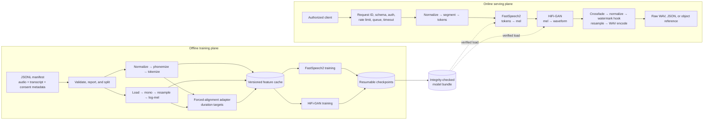

# Build Your Own TTS

A complete, modular text-to-speech engineering reference built with a FastSpeech2-style acoustic model
and a HiFi-GAN-style neural vocoder. The repository covers data governance and validation, text/audio
processing, alignment contracts, model training, versioned inference, HTTP serving, observability,
security, deployment, testing, and responsible use.

It does not ship trained voices. No commercial AI API is required. A bundle exported without trained
checkpoints is deliberately a random-weight smoke-test bundle and produces noise-like audio.

## What this repository is for

The project is designed for engineers who want to understand and own an end-to-end speech-synthesis
system instead of wrapping an opaque hosted endpoint. It makes difficult dependencies explicit:

- duration labels need a real forced-alignment process;
- pronunciation depends on normalization, language rules, phonemizer, and vocabulary version;
- a vocoder is compatible with an exact mel definition, not only “80 mel bins”;
- reproducibility needs data/config/code/environment lineage, not only a random seed;
- a valid WAV proves interface correctness, not model quality or permission to use a voice; and
- production voice synthesis needs authorization, abuse prevention, privacy, and revocation.

Use it as a trainable reference and extensible platform, not as a claim of frontier model quality.

## Handbook

The long-term technical reference begins at [docs/index.md](docs/index.md). It contains from-first-
principles explanations, exact tensor/artifact contracts, formulas, worked examples, failure modes, and
production extension guidance.

Core reading order:

1. [System architecture](docs/architecture.md)
2. [Configuration reference](docs/configuration.md)
3. [Data pipeline](docs/data-pipeline.md)
4. [Text processing](docs/text-processing.md)
5. [Audio processing](docs/audio-processing.md)
6. [Alignment and durations](docs/alignment.md)
7. [Acoustic model](docs/acoustic-model.md)
8. [Vocoder](docs/vocoder.md)
9. [Training](docs/training.md)
10. [Inference](docs/inference.md)
11. [API](docs/api.md)
12. [Evaluation](docs/evaluation.md)
13. [CLI reference](docs/cli.md) and [testing strategy](docs/testing.md)
14. [Artifacts](docs/artifacts.md)
15. [Deployment](docs/deployment.md), [observability](docs/observability.md),
    [security](docs/security.md), and [responsible use](docs/responsible-use.md)

The [glossary](docs/glossary.md) defines speech/model terms and shape notation. The
[architecture ADR](docs/adr/0001-model-architecture.md) records why this model split was selected.

## Architecture at a glance



FastSpeech2 was selected for explicit duration/pitch/energy control and parallel inference. HiFi-GAN was
selected for a clear, independently trainable, parallel mel-to-waveform boundary. See the ADR for
alternatives and consequences.

## Repository structure

```text
.
├── README.md, MODEL_CARD.md, DATA_CARD.md, SECURITY.md
├── CONTRIBUTING.md, CODE_OF_CONDUCT.md, CHANGELOG.md, LICENSE
├── pyproject.toml, requirements.lock, Makefile
├── configs/
│   ├── base.yaml
│   ├── development.yaml
│   └── test.yaml
├── docs/
│   ├── index.md, glossary.md, architecture.md, configuration.md, artifacts.md
│   ├── data-pipeline.md, text-processing.md, audio-processing.md, alignment.md
│   ├── acoustic-model.md, vocoder.md, training.md, inference.md, evaluation.md, cli.md
│   ├── api.md, deployment.md, observability.md, security.md
│   ├── responsible-use.md, troubleshooting.md, testing.md
│   └── adr/0001-model-architecture.md
├── scripts/
│   ├── create_tiny_fixture.py
│   ├── download_example_data.py
│   ├── export_model.py
│   └── benchmark.py
├── src/tts_pipeline/
│   ├── config.py, errors.py, cli.py
│   ├── data/, text/, audio/, alignment/
│   ├── models/acoustic/, models/vocoder/, losses/
│   ├── training/, evaluation/, inference/
│   ├── serving/, security/, storage/, observability/, utils/
│   └── __init__.py
├── tests/{unit,integration,e2e,performance,regression}/
├── docker/{Dockerfile,Dockerfile.gpu,entrypoint.sh}
├── docker-compose.yml
└── .github/workflows/{ci.yml,security.yml,docker.yml}
```

## Requirements and installation

- Python 3.11 or newer
- libsndfile for full audio-format support
- espeak-ng only when using the optional espeak phonemizer
- a CUDA-compatible PyTorch environment only for GPU execution

```bash
python3.11 -m venv .venv
source .venv/bin/activate
python -m pip install --upgrade pip
python -m pip install -e '.[dev]'
```

Optional integrations:

```bash
python -m pip install -e '.[phonemes]'  # Python phonemizer; requires local espeak
python -m pip install -e '.[mlflow]'    # MLflow tracker adapter
python -m pip install -e '.[otel]'      # OpenTelemetry tracer adapter
```

Validate the resolved config and its cross-component invariants:

```bash
tts validate-config --config configs/development.yaml
```

## Configuration profiles

`base.yaml` defines the reference shape and production-oriented defaults. `development.yaml` reduces
model/training sizes for local work. `test.yaml` is a tiny deterministic profile. YAML inheritance merges
nested sections; unknown fields fail validation. Environment can relocate model/device/concurrency
without editing the file.

The full configuration fingerprint records every resolved field for experiments. The artifact fingerprint
records only tensor-relevant audio/model/vocoder fields so moving a bundle does not invalidate it. Read
[configuration.md](docs/configuration.md) before changing DSP or model dimensions.

## End-to-end synthetic development workflow

The fixture contains generated sine waves and invented transcripts, so it exercises code without a real
speaker.

```bash
python scripts/create_tiny_fixture.py --output data/tiny
tts validate-dataset data/tiny/manifest.jsonl --config configs/development.yaml
tts build-vocabulary data/tiny/manifest.jsonl --output artifacts/vocabulary.json
tts preprocess data/tiny/manifest.jsonl data/tiny/processed artifacts/vocabulary.json \
  --fixture-alignment --config configs/development.yaml
```

`--fixture-alignment` uniformly allocates frames and pitch is zero in this fixture path. It proves
serialization, collation, loss, and CLI behavior only. Do not train a natural voice with those targets.

## Dataset manifest

One UTF-8 JSON object per line:

```json
{"audio_path":"wavs/a.wav","transcript":"Hello.","speaker_id":"default","language":"en-US"}
```

Relative paths resolve from manifest directory. Validation detects duplicates, missing/corrupt audio,
empty transcripts, duration bounds, sample-rate/channel warnings, and speaker distribution. Production
data additionally needs explicit license/consent/provenance, session-aware leakage control, audio/text
quality analysis, quarantine, and revocation lineage. See [DATA_CARD.md](DATA_CARD.md).

## Acoustic training

```bash
tts train-acoustic data/tiny/processed/index.jsonl artifacts/vocabulary.json \
  --run-dir runs/acoustic --config configs/development.yaml
```

Resume restores weights, optimizer, scheduler, AMP scaler, epoch, step, best validation, and early-stop
state:

```bash
tts train-acoustic data/tiny/processed/index.jsonl artifacts/vocabulary.json \
  --run-dir runs/acoustic --resume runs/acoustic/latest.pt \
  --config configs/development.yaml
```

The trainer supports accumulation, clipping, AMP on CUDA, validation, early stopping, periodic/atomic
checkpoints, graceful interrupt, and local JSONL tracking. A tiny fixture validates the loop; it cannot
produce intelligible speech.

## Vocoder training

```bash
tts train-vocoder data/corpus/manifest.jsonl --run-dir runs/vocoder \
  --config configs/base.yaml
```

Vocoder training alternates separate discriminator and generator updates and restores generator, MPD,
MSD, both optimizers/schedulers, scaler, epoch, and step. Real quality training requires clean licensed
audio, longer/randomized segments, held-out listening, and stable adversarial monitoring.

## Export and synthesis

Export an initialized smoke bundle:

```bash
tts export-model artifacts/demo --vocabulary artifacts/vocabulary.json \
  --version development --config configs/development.yaml
```

If an acoustic checkpoint is supplied, its model state is loaded. A production release workflow should
also promote an approved trained generator and complete model/data/evaluation review.

```bash
tts synthesize "Dr. Rao paid $12.50 at 14:30." \
  --output speech.wav --seed 7 --config configs/development.yaml
```

Output metadata includes request ID, duration, token/character counts, latency, RTF, model version, rate,
speaker, and language. Normalized text is hidden unless explicitly enabled.

## API quick start

```bash
export TTS_MODEL_DIR=artifacts/demo
export TTS_API_KEY='development-secret'
tts serve --config configs/development.yaml
```

```bash
curl --fail-with-body http://localhost:8000/v1/synthesize \
  -H 'Content-Type: application/json' \
  -H "X-API-Key: $TTS_API_KEY" \
  --data '{"text":"Hello from the TTS platform.","response_format":"wav"}' \
  --output response.wav
```

Endpoints:

| Method/path | Purpose |
|---|---|
| `POST /v1/synthesize` | WAV, development base64, or storage reference |
| `POST /v1/synthesize/stream` | chunked delivery of completed WAV |
| `POST /v1/normalize` | deterministic normalization and optional trace |
| `GET /v1/models` | loaded model/version |
| `GET /v1/speakers` | bundle speaker IDs |
| `GET /health` | process liveness |
| `GET /ready` | verified model readiness |
| `GET /metrics` | Prometheus exposition |

The service includes request IDs, declared-body bound, strict schemas, shared-key hook, process-local token
bucket, bounded concurrency, queue/request timeouts, idempotency reference, privacy-safe logs, and metrics.
Read [api.md](docs/api.md) for limitations and production gateway requirements.

## Evaluation and benchmarking

```bash
tts evaluate speech.wav
tts benchmark --iterations 3 --config configs/development.yaml
```

The CLI covers signal and latency checks, not naturalness. A model release needs held-out ASR WER/CER,
human MOS/preference, prosody/speaker evaluation, robustness, fairness slices, performance percentiles,
and safety review. See [evaluation.md](docs/evaluation.md) and [MODEL_CARD.md](MODEL_CARD.md).

## Testing and static analysis

```bash
ruff format --check .
ruff check .
mypy
python scripts/validate_docs.py
pytest --cov=tts_pipeline --cov-report=term-missing
```

Tests cover deterministic text, vocabulary integrity, DSP shape/finiteness, alignments, model/loss shapes,
manifest splits, bundle export/load, HTTP behavior, e2e WAV generation, and regressions. Neural exactness
across hardware is not assumed; use documented tolerances for real model regression.

## Docker

```bash
docker compose build tts
docker compose run --rm tts tts export-model artifacts/demo
docker compose up tts
```

Compose runs non-root with read-only root, dropped capabilities, no-new-privileges, tmpfs, and readiness
probe. Separate read-only bundle storage from writable output storage in production. The GPU Dockerfile
requires host/container CUDA compatibility and one process per GPU by default.

## Security and responsible use

Only train and synthesize voices under explicit, informed permission for the intended use. Do not use the
project for covert cloning, impersonation, fraud, harassment, biometric bypass, fabricated evidence, or
unlawful/deceptive content. Public recordings are not blanket consent.

Production needs real identity and per-speaker authorization, distributed rate/output limits, immutable
signed artifacts, privacy/retention controls, abuse monitoring/reporting, revocation lineage, and tested
disclosure/watermark policy. The default watermarker is a no-op and makes no disclosure claim.

Read [responsible use](docs/responsible-use.md), [security architecture](docs/security.md), and
[vulnerability reporting](SECURITY.md) before deployment.

## Known limitations

- No trained weights, production aligner, or production F0 estimator are included.
- English normalization covers documented bounded patterns, not every locale/domain ambiguity.
- Automatic phonemizer fallback should be replaced by an explicitly pinned production backend.
- Fixture alignment/pitch cannot produce natural training targets.
- Online rate/idempotency state is process-local.
- Route timeout does not forcibly cancel already-running thread/native/GPU work.
- Streaming endpoint chunks completed WAV rather than generating audio incrementally.
- Local storage has no download lifecycle/tenant isolation.
- No-op watermarking and shared API key are integration references, not complete safety systems.

## Troubleshooting

If readiness, fingerprints, alignments, NaN loss, noisy audio, pronunciation, CUDA memory, timeout, or
rate-limit behavior is wrong, use the stage-by-stage [troubleshooting runbook](docs/troubleshooting.md).
Diagnose text → tokens → durations → mel → vocoder → post-processing rather than changing model size at
random.

## License and contributions

Apache-2.0 licensed. Contributions must pass formatting, lint, typing, and tests; update affected handbook
contracts; and provide rights/consent/cards for any voice/data/model artifact. See
[CONTRIBUTING.md](CONTRIBUTING.md) and [CODE_OF_CONDUCT.md](CODE_OF_CONDUCT.md).
