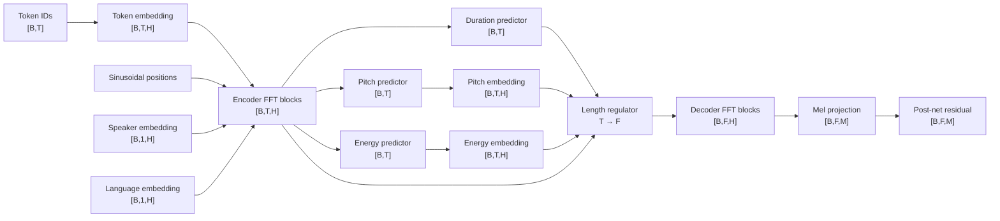

# FastSpeech2-style acoustic model

## 1. Role of the acoustic model

The acoustic model maps token IDs to a log-mel spectrogram. It does not create waveform samples. Its
input represents content plus speaker/language/control information; its output represents how energy is
distributed over mel frequency bands through time.

The implementation is “FastSpeech2-style” because it contains parallel Transformer-like FFT blocks,
duration/pitch/energy predictors, length regulation, decoder blocks, mel projection, and post-net. It is
compact enough for CPU smoke tests and is not claimed to reproduce every detail or quality result of the
original research configuration.



During training, duration, pitch, and energy teacher targets replace the corresponding predicted values
for conditioning while the predictors still emit values for loss. During inference, bounded predictions
and user controls drive the same path.

## 2. Shape notation and inputs

Inputs to `FastSpeech2.forward` are:

| Input | Shape | Meaning |
|---|---:|---|
| `tokens` | `[B,T]` | padded vocabulary IDs |
| `token_lengths` | `[B]` | real token count per row |
| `speaker_ids` | `[B]` | speaker embedding indices |
| `language_ids` | `[B]` | language embedding indices |
| duration target | `[B,T]` | teacher mel-frame counts |
| pitch target | `[B,T]` | teacher token-level F0 representation |
| energy target | `[B,T]` | teacher token-level energy |

Controls `rate`, `pitch_scale`, and `energy_scale` are scalar in the current interface. A production batch
API may extend them to per-row tensors while preserving bounds.

The first vocabulary ID is padding. `sequence_mask(lengths,T)` builds `[B,T]` valid positions. The model
inverts it for PyTorch attention, whose `key_padding_mask=True` means “ignore this position.” Confusing
these polarities can make the network attend only to padding.

## 3. Embedding and conditioning

Token lookup transforms `[B,T]` to `[B,T,H]`; padding embedding is fixed by `padding_idx=0`. Sinusoidal
position vectors provide order because self-attention alone is permutation invariant. Speaker and
language embeddings are `[B,H]`, expanded to `[B,1,H]`, and added to every token state.

Addition instead of concatenation keeps hidden size constant and makes conditioning available from the
first encoder layer. It assumes IDs are known and in table range. The bundle’s authorized speaker and
language lists define the external name-to-index order; changing that order without retraining is a
semantic compatibility failure.

Sinusoidal positions are precomputed through `max_positions`. Any token or expanded mel sequence beyond
that bound is rejected or duration-scaled before decoder position use.

## 4. FFT block

Each encoder/decoder FFT block contains:

1. batch-first multi-head self-attention;
2. residual addition and LayerNorm;
3. Conv1d `H -> conv_filter_size` with kernel 9;
4. GELU and dropout;
5. pointwise Conv1d back to `H` and dropout;
6. second residual addition and LayerNorm; and
7. padding zeroing.

Conv1d expects `[B,channels,time]`, so code transposes `[B,T,H]` to `[B,H,T]` and back. The kernel-nine
convolution supplies a local receptive field alongside global attention. Attention cost grows roughly as
`T²`, one reason input chunks are bounded.

Padding is masked in attention and zeroed after the block. Convolution can still observe zeros around
real boundaries; this is acceptable but means padding values must remain stable.

## 5. Variance predictors

Duration, pitch, and energy predictors share a topology but not weights:

```text
[B,T,H]
 -> Conv1d(H,V,k), ReLU, LayerNorm(V), Dropout
 -> Conv1d(V,V,k), ReLU, LayerNorm(V), Dropout
 -> Linear(V,1)
 -> [B,T]
```

An odd kernel is required so symmetric padding preserves `T`. Outputs at padding positions are forced to
zero. Duration output is interpreted as log duration; pitch and energy output use the target space chosen
by preprocessing. A production system should normalize pitch/energy by training statistics and store
those statistics in the bundle; the compact reference uses raw token targets.

## 6. Pitch and energy conditioning

During training, supplied teacher targets condition the hidden sequence. During inference, predictions
are multiplied by pitch/energy controls. Each scalar sequence `[B,T]` becomes `[B,1,T]`, passes through a
kernel-three Conv1d to `H` channels, and is added to encoder state.

This design alters conditioning values; it does not guarantee a perceptually linear semitone or loudness
change. A `pitch=1.2` scale is a model-space multiplier, not “20% higher perceived pitch.” User-facing
controls should be evaluated and possibly mapped through calibrated transforms.

## 7. Duration transformation and safety

Training target `d >= 0` is transformed to `log(1+d)` for MSE. This compresses long-duration range and
keeps zero representable. Inference computes approximately:

`d = round(expm1(clamp(prediction)) / rate)`.

Rate greater than one shortens durations and speaks faster. Predictions are clamped before exponentiation
and per-token duration is capped at 50 frames so corrupt or untrained weights cannot request an enormous
allocation. Every valid token gets at least one frame in inference to keep smoke-test models from
returning empty audio. If row total exceeds `max_positions`, durations are proportionally scaled and
floored, with valid tokens kept at one.

These are service-safety constraints. A well-trained model should rarely hit them; monitor clamp rates
because frequent clamping signals bad weights, target mismatch, or out-of-domain text.

## 8. Length regulation

For token state `h_t` and duration `d_t`, the regulator emits:

`[h_1 repeated d_1 times, h_2 repeated d_2 times, ...]`.

Each batch row can produce a different `F`. Rows are padded to the maximum expanded length, and mel
lengths build a new mask. Example:

```text
tokens:       [BOS, h, i, EOS]
durations:    [  1, 2, 3,   1]
expanded IDs: [BOS, h, h, i, i, i, EOS]  -> F=7
```

The implementation loops over batch rows because repeat counts differ. For large production batches, a
vectorized or fused regulator may improve performance after correctness testing.

## 9. Decoder, projection, and post-net

Expanded states receive frame positions and pass through decoder FFT blocks using the mel padding mask.
A linear projection maps `[B,F,H]` to initial mel `[B,F,M]`. The post-net transposes to channels-first and
applies configurable Conv1d/BatchNorm/Tanh/Dropout layers. Its output is a residual correction:

`mel_postnet = mel + postnet(mel)`.

Both outputs are zeroed at padded frames. BatchNorm statistics make training/eval mode important; bundle
loading calls `.eval()` before inference.

## 10. Output contract

`FastSpeech2Output` returns initial/refined mel, all three predictions, selected integer durations, token
valid mask, and mel valid mask. Returning predictions even when teachers conditioned the forward pass
lets one call compute supervised losses.

Mel orientation is `[B,F,M]` in the acoustic model. HiFi-GAN expects `[B,M,F]`, so inference performs one
transpose at the boundary.

## 11. Losses

The acoustic objective sums:

- masked L1 between initial mel and target;
- masked MSE between post-net mel and target;
- masked MSE between predicted log duration and `log1p(target)`;
- masked pitch MSE; and
- masked energy MSE.

Mask expansion makes `[B,F]` cover mel channels. Reduction selects only valid elements and rejects empty
masks and non-finite selected values. Negative duration targets are rejected. Loss weights are currently
equal; quality training often introduces tuned weights and normalized targets, which must be documented
and included in experiment configuration.

## 12. Training versus inference table

| Component | Training | Inference |
|---|---|---|
| duration conditioning | teacher duration | predicted, rate-adjusted, bounded |
| pitch conditioning | teacher pitch | predicted × pitch control |
| energy conditioning | teacher energy | predicted × energy control |
| dropout | enabled | disabled by `.eval()` |
| BatchNorm | updates/runs batch stats | stored running stats |
| gradients | enabled | `torch.inference_mode()` |

Mismatch between teacher-conditioned training and fully predicted inference is a source of error. Always
evaluate inference mode, not only validation loss with teacher targets.

## 13. Multi-speaker and multilingual behavior

Speaker/language embeddings provide conditioning capacity but do not create data coverage. Every ID needs
enough representative, consented training data. Imbalanced speakers can cause underfit minority voices or
speaker leakage. Language embeddings require compatible text inventories and data; the model currently
uses one shared vocabulary and hidden space.

Unknown/restricted speaker names are rejected before model indexing. Enrollment, authorization, and
speaker mapping are governance concerns outside the embedding table.

## 14. Failure modes and diagnosis

- **Skipped/repeated content:** inspect normalization, token stream, and durations.
- **Too fast/slow:** compare duration target/prediction distributions and rate control.
- **Flat prosody:** inspect pitch/energy extraction, normalization, losses, and teacher/prediction gap.
- **Muffled mel:** compare feature scale and post-net behavior; ensure target orientation/mask.
- **Speaker leakage:** audit balance, conditioning IDs, train/test policy, and embedding similarity.
- **NaN loss:** inspect cached arrays, empty masks, learning rate, AMP scale, and target ranges.
- **Position overflow:** inspect duration predictions and chunk sizes; do not merely raise the bound until
  memory/latency impact is understood.

For every investigation, log numeric summaries and sample IDs—not private transcripts in shared logs.
