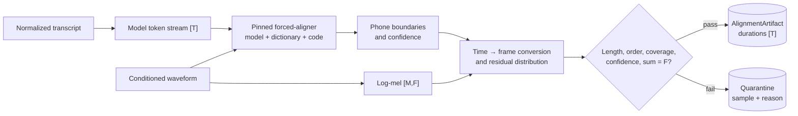

# Token-to-frame alignment and duration generation

## 1. Why durations are required

FastSpeech2 encodes one state per input token but predicts one mel vector per acoustic frame. The length
regulator needs to know how many frames each token occupies. During inference a duration predictor
supplies those values; to train that predictor, the dataset must contain duration targets derived from an
alignment process.

Duration labels do not appear automatically from a transcript and WAV. The project therefore isolates an
alignment adapter and refuses to call fixture allocation a production aligner.



## 2. Artifact contract

`AlignmentArtifact` contains:

- `durations`: ordered non-negative integer frames per token;
- `token_count`: expected duration-vector length;
- `frame_count`: expected sum;
- `backend` and `backend_version`;
- `source_fingerprint`: identity of source/features/vocabulary inputs.

Validation enforces:

```text
len(durations) == token_count
all(duration >= 0)
sum(durations) == frame_count
```

Zero duration can be legitimate for boundary or punctuation tokens, depending on alignment policy. A
real phoneme should generally receive frames; excessive zeros are a quality signal even when schema is
valid.

Artifacts are JSON rather than pickle so they are auditable, diffable, and safe to load. Any schema
change requires a backend/format migration strategy.

## 3. Time-to-frame conversion

A forced aligner commonly returns start/end seconds for words or phones. Convert boundaries with sample
rate `R` and hop `H`. A frame time is approximately `frame_index * H / R`, with a centering convention
that must match feature extraction.

Independent rounding of each phone can make totals differ from mel frames. A robust converter should:

1. map ordered boundaries to continuous frame coordinates;
2. derive non-negative raw spans;
3. round with a deterministic policy;
4. distribute residual frames across eligible tokens; and
5. assert the exact final sum.

Never hide residual mismatch by padding mel targets after the fact; that disconnects durations from the
actual feature sequence.

## 4. Production forced-aligner workflow

Montreal Forced Aligner (MFA) is a common reference backend, but is not bundled. A production adapter
should:

1. prepare audio at the expected format and transcripts after a defined text/G2P stage;
2. select pinned language acoustic and pronunciation dictionary models;
3. include out-of-vocabulary pronunciation handling and reports;
4. run alignment offline in an isolated job;
5. parse phone tiers, mapping aligner phones to model tokens and boundaries;
6. convert time spans to configured mel frames;
7. calculate confidence/coverage and validate ordering/sums;
8. write versioned artifacts and a quarantine manifest; and
9. listen to sampled alignments before training.

The token stream passed to the acoustic model must correspond to the aligner stream. BOS/EOS,
punctuation, word boundaries, stress marks, silence phones, and unknown symbols need an explicit mapping.

## 5. Detecting bad alignments

Schema validity is necessary but not enough. Quarantine or investigate:

- alignment does not cover the utterance;
- phones appear out of order or overlap unexpectedly;
- too many OOV words or fallback pronunciations;
- real phones receive zero frames;
- a single phone has implausibly long duration;
- speech-to-text duration ratio is extreme;
- leading/trailing silence dominates;
- confidence is below a backend-specific threshold;
- sum can be repaired only with a large residual; or
- listening reveals boundaries shifted from speech.

Report failures by speaker, language, recording session, and text phenomenon; systematic failures often
indicate normalization/dictionary mismatch rather than random noise.

## 6. Fixture backend

`UniformAlignmentBackend` divides `frame_count` by token count, gives every token the quotient, and
assigns the remainder one frame at a time from the beginning. It requires at least one frame per token.
This creates an exactly valid duration vector and is excellent for testing preprocessing, collation,
losses, serialization, and resume.

It has no knowledge of speech. Vowels, stops, punctuation, and BOS/EOS receive nearly identical timing.
Training natural speech with it teaches incorrect duration targets and mis-averages energy/pitch. The CLI
therefore requires `--fixture-alignment` or `--fixture` explicitly.

## 7. Cache and versioning

An alignment cache key must change when audio content/trim, transcript normalization, phonemizer,
vocabulary, aligner code/model/dictionary, sample rate, hop, or frame-centering convention changes. The
reference source fingerprint combines record identity, audio fingerprint, and vocabulary checksum; a
production adapter must add aligner assets and content hashes.

Store raw aligner outputs as well as converted durations when possible. Raw boundaries allow future
conversion-policy audits without rerunning the aligner.

## 8. Alternative strategies

Monotonic alignment search, an attention teacher, or dataset-provided alignments can implement the same
artifact contract. Each has different failure signals and licensing/runtime dependencies. A new backend
must be evaluated against hand-inspected alignments and demonstrate that token/frame conventions match
the acoustic features.

## 9. Alignment debugging procedure

For one failed sample, render normalized text, phoneme symbols and IDs, phone time intervals, integer
durations, cumulative frame boundaries, and a mel plot with vertical boundaries. Play audio while
following the plot. Then decide whether the source is transcript, G2P, dictionary, silence policy,
resampling/trim, frame conversion, or aligner confidence. Do not “fix” the model until the targets are
known correct.
