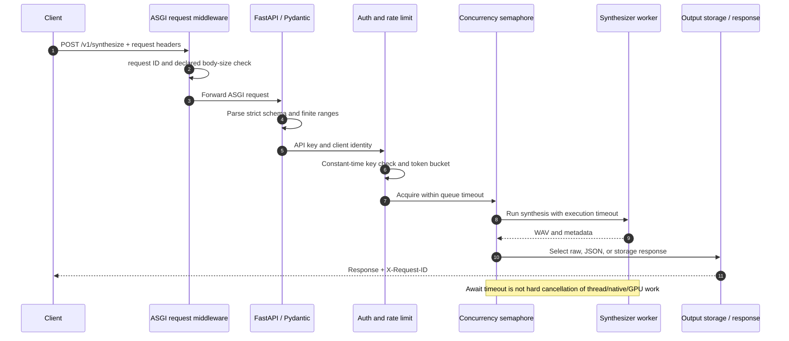

# HTTP API contract and serving behavior

## 1. Application lifecycle

`create_app(settings, synthesizer=None)` builds FastAPI routes and operational controls. During lifespan,
an injected synthesizer is used for tests/embedding; otherwise the configured model bundle is loaded. A
load failure is logged without crashing the process, liveness remains available, and readiness returns
503 with the model unavailable.

OpenAPI is available at `/docs` and `/openapi.json`. The API version is `1.0.0`; model version is separate
and returned in synthesis metadata.

## 2. Request processing layers

For HTTP synthesis, the effective sequence is:



1. pure ASGI middleware assigns/preserves `X-Request-ID` and checks declared content length;
2. FastAPI parses JSON and Pydantic rejects extra fields/type/range violations;
3. API-key and token-bucket dependency runs;
4. route checks idempotency state;
5. model readiness is checked;
6. request waits for bounded concurrency semaphore;
7. synchronous model work runs in a worker thread with an await timeout;
8. response is encoded as WAV, JSON, or storage reference; and
9. metrics and audit-safe completion log are emitted.

Ingress infrastructure must also enforce TLS, actual streamed body size, connection/time limits,
distributed quotas, and tenant authorization. Application controls are defense in depth.

## 3. `POST /v1/synthesize`

Request example:

```json
{
  "text": "Dr. Rao paid $12.50 at 14:30.",
  "language": "en-US",
  "speaker_id": "default",
  "rate": 1.0,
  "pitch": 1.0,
  "energy": 1.0,
  "output_sample_rate": 22050,
  "seed": 7,
  "response_format": "wav"
}
```

`text` is 1–5000 schema characters and is additionally checked by configured normalizer limit. Language
syntax is constrained but support is determined by bundle metadata. Numeric controls accept only finite
0.5–2.0. Sample rate is optional 8,000–48,000. Seed is a non-negative signed-32-bit value.

### WAV response

Recommended production response is `audio/wav`. `X-TTS-Metadata` is URL-safe base64 of metadata JSON;
clients should treat it as informational and bound header parsing. `X-Request-ID` is always returned.

```bash
curl --fail-with-body http://localhost:8000/v1/synthesize \
  -H 'Content-Type: application/json' \
  -H "X-API-Key: $TTS_API_KEY" \
  -H 'Idempotency-Key: job-8d931' \
  --data '{"text":"Hello.","response_format":"wav"}' \
  --output hello.wav
```

### JSON response

Development-only JSON contains base64 WAV plus metadata. Base64 grows payload roughly one third and
requires the whole audio in memory. It returns 406 when disabled.

### Storage response

The local storage implementation hashes WAV content, writes atomically under configured output root, and
returns opaque key. It does not expose a download endpoint. Production should inject object storage with
tenant isolation, encryption, retention, signed retrieval, and deletion policy.

## 4. `POST /v1/synthesize/stream`

Accepts the same request and forces WAV response. It yields a completed WAV in 64 KiB HTTP chunks and
stops yielding after client disconnect. It does not yet reduce neural time-to-first-byte; see
[inference streaming semantics](inference.md#9-streaming-semantics).

## 5. `POST /v1/normalize`

Request contains text and optional `trace`. Response contains final normalized string and ordered stage
objects. This endpoint is useful for debugging and product previews but exposes transformed input; apply
the same authentication/privacy policy as synthesis in production.

## 6. Discovery and probes

- `GET /v1/models` returns ID, bundle version, and architecture after readiness.
- `GET /v1/speakers` returns bundle-authorized speaker IDs. It is not tenant-specific authorization.
- `GET /health` returns 200 when process/router is alive.
- `GET /ready` returns 200 only when synthesizer is loaded; otherwise 503.
- `GET /metrics` returns Prometheus exposition and is excluded from public OpenAPI.

Restrict metrics and discovery endpoints at the network layer if model/speaker names are sensitive.

## 7. Authentication and authorization

If the environment named by `serving.api_key_env` is empty, API-key authentication is disabled. If set,
the caller supplies `X-API-Key`; comparison uses constant-time `hmac.compare_digest`. This is a hook, not
a complete identity system: there is one shared secret and no user/speaker claims.

Production gateway authentication should issue an identity and authorized speaker/model scopes. Routes
must enforce those scopes before synthesis. Rotate keys and never put them in config files, URLs, logs,
or container images.

## 8. Rate limiting and concurrency

The in-memory token bucket is keyed by client host, starts with capacity 10, refills one token/second,
and prunes stale buckets when map grows. It is process-local, resets on restart, and sees proxy address
unless trusted forwarding is configured. Replace it with gateway/distributed limiting for real service.

Rate limit controls arrival. Semaphore controls simultaneous model work. If semaphore is not acquired
within queue timeout, return 503. Once acquired, active metric increments and is decremented in `finally`.
Tune concurrency by measured peak model memory and latency, not CPU count.

## 9. Timeouts and cancellation limitation

`asyncio.wait_for` limits how long the route awaits worker-thread synthesis. Cancelling the await does not
forcibly stop arbitrary Python/native/GPU work already running in the thread. The semaphore is released
in the route even though underlying work may finish later, so repeated hard timeouts can temporarily
exceed intended hardware load. For strict isolation, run synthesis in cancellable worker processes or a
dedicated queue system with execution leases.

Streaming checks disconnect only while yielding. Library `cancelled` callback checks between neural
chunks but is not currently wired from the route’s disconnect into worker execution.

## 10. Idempotency

If `Idempotency-Key` has a cached request, the route compares SHA-256 of canonical Pydantic JSON. Same key
and same body replays bytes/metadata; same key and different body returns 409. Cache holds at most 128
entries and evicts oldest insertion. It is memory-local, non-persistent, non-tenant-aware, and stores WAV
bytes, so it is a development reference.

Production idempotency requires tenant+key namespace, TTL, size limit, distributed atomic claim/result,
request hash, encryption, and policy for failed/in-progress operations.

## 11. Status and error model

| Status | Meaning |
|---:|---|
| 200 | successful response/probe |
| 400 | domain validation such as unknown speaker |
| 401 | invalid API key |
| 406 | requested base64 format disabled |
| 409 | idempotency key conflict |
| 413 | declared body too large |
| 422 | Pydantic schema/type/range failure |
| 429 | rate limit exceeded |
| 503 | model unavailable or queue acquisition timeout |
| 504 | synthesis await timeout |

Expected domain/HTTP handlers return `{request_id, code, message}`. FastAPI’s built-in 422 schema differs;
clients should handle status plus documented body. Unexpected exceptions should be sanitized by
production error middleware and traced by request ID without returning stack details.

## 12. Privacy-safe logging and metrics

Completion logs contain request ID, status, latency, and logger metadata. They intentionally omit text,
normalized text, token IDs, raw audio, API key, and speaker labels. Prometheus labels avoid user/model
cardinality and sensitive values. Request character totals are aggregate counters.

## 13. Production hardening checklist

- TLS and trusted reverse proxy configuration.
- OIDC/service identity and per-tenant speaker/model authorization.
- Actual streaming body limit and connection/header limits.
- Distributed rate/idempotency/queue controls.
- One model process per GPU and capacity-tested concurrency.
- Private metrics, sanitized exception handling, trace sampling.
- Egress restriction, read-only model mounts, non-root container.
- Output retention/deletion and privacy review.
- Abuse monitoring, consent enforcement, disclosure/watermark policy.
- Load, timeout, disconnect, and rollback tests.
