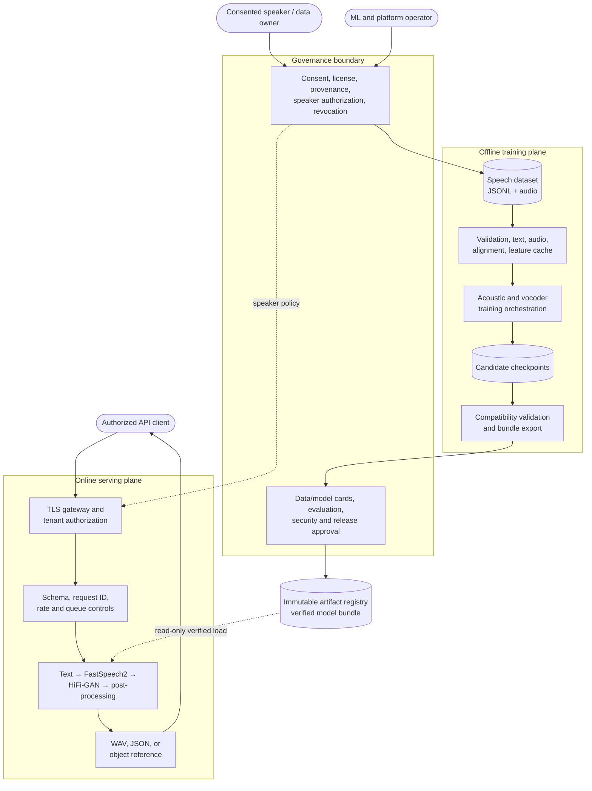
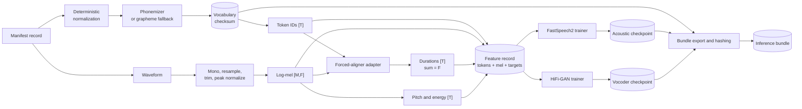
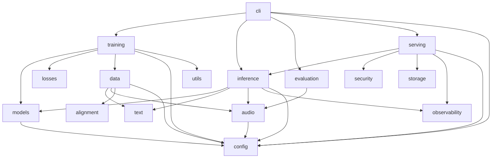
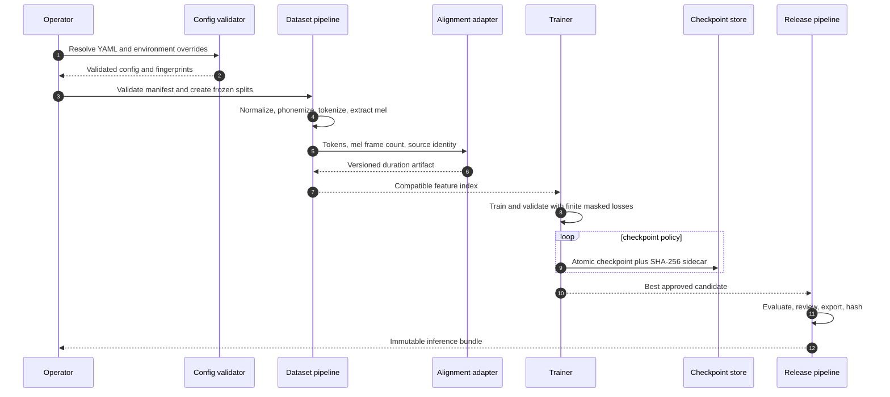
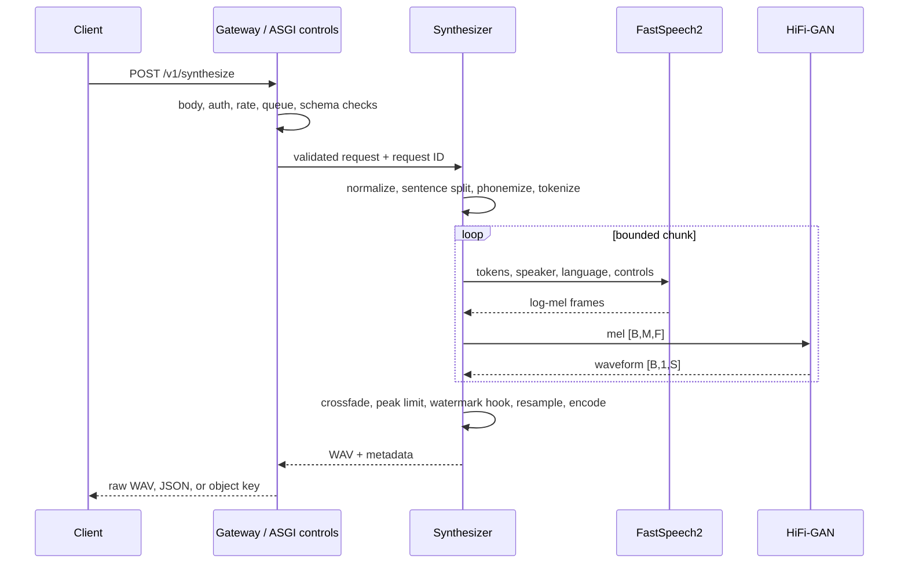
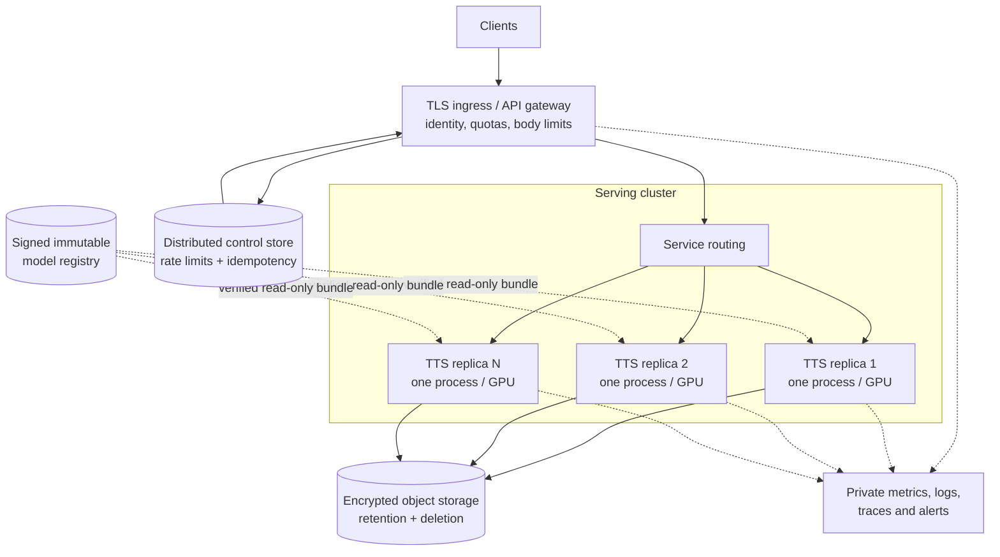

# System architecture

## 1. Purpose and system boundary

The system turns consented, licensed speech data into a versioned text-to-speech model and exposes that
model through a bounded inference service. The platform owns the transformations between manifest,
training features, model checkpoints, inference bundles, and WAV responses. It does not own speaker
identity verification, a production forced-aligner installation, a distributed rate-limit database,
cloud object storage, or a watermark algorithm; those are explicit integration boundaries.

The primary architectural objective is replaceability. Text rules, phonemizer, aligner, acoustic model,
vocoder, storage, tracker, tracer, and watermarker are separated so one can change without rewriting the
HTTP layer or data manifest.

## 2. High-level topology

The trust boundary is intentional: a model cannot move from training into online service merely because
training completed. It must pass evaluation and governance review, be exported into an immutable bundle,
and then be verified again when loaded by serving.

### 2.1 Training and artifact data flow

Training and serving are deliberately different planes. Serving never downloads models, aligns audio,
builds vocabularies, or mutates training data. Training code does not import FastAPI. This separation
reduces the production attack surface and prevents request traffic from triggering expensive or
nondeterministic data preparation.

## 3. Package boundaries

The package graph keeps model mathematics independent of transport and offline data preparation
independent of the web application:

| Package | Responsibility | Must not own |
|---|---|---|
| `config` | typed YAML resolution and cross-field invariants | environment-specific business logic |
| `data` | manifest schema, validation, splitting, training datasets | model architecture |
| `text` | normalization, phonemization, vocabulary | HTTP response behavior |
| `audio` | waveform I/O, resampling, mel extraction, WAV encoding | dataset consent decisions |
| `alignment` | duration artifact contract and fixture backend | pretending duration labels are automatic |
| `models` | tensor-to-tensor neural modules | file paths, logging, APIs |
| `losses` | finite, mask-aware objectives | optimizer steps |
| `training` | optimization, tracking, checkpoint recovery | online request handling |
| `inference` | bundle loading and end-to-end synthesis | authentication and quotas |
| `serving` | HTTP translation, limits, concurrency, errors | model math |
| `security` | authentication/rate-limit interfaces | tenant-specific identity provider |
| `storage` | content-addressed output storage | accepting user-selected paths |
| `observability` | JSON logs and tracing boundary | transcript contents |

Dependencies should point from orchestration layers toward lower-level components. For example,
`serving` depends on `inference`, but `inference` does not know FastAPI exists. A future gRPC server can
reuse the synthesizer without importing HTTP routes.

## 4. Training control flow

1. Configuration is loaded and validated before expensive work. Cross-field checks include Nyquist
   limits, attention-head divisibility, and vocoder upsample product versus STFT hop length.
2. The manifest loader resolves relative audio paths against the manifest directory and converts every
   row to a typed record.
3. Validation performs cheap transcript/path checks and then audio-header checks. Invalid samples are
   reported with record context; they should be quarantined rather than silently skipped.
4. Text is normalized, phonemized, and encoded with a checksum-protected vocabulary.
5. Audio becomes a finite mono waveform at the configured sample rate; log-mel features are extracted.
6. An alignment backend produces one integer duration per token. The sum must equal the mel frame count.
7. Preprocessed arrays are stored by a content-derived key and referenced from `index.jsonl`.
8. The acoustic trainer uses duration/pitch/energy teacher targets. The vocoder trainer independently
   uses fixed waveform segments and their mel representations.
9. Validation loss drives early stopping and the `best.pt` checkpoint. `latest.pt` supports recovery.
10. Export constructs inference modules, loads approved checkpoints, writes vocabulary and weights, and
    records hashes plus an artifact compatibility fingerprint.

No step assumes that an alignment or pretrained weight exists. Fixture commands require an explicit
flag so a smoke-test shortcut cannot be confused with the production path.

## 5. Inference control flow

The service validates twice by design. Pydantic rejects malformed public input; the synthesizer also
checks language, speaker, finite controls, and sample rate so CLI and non-HTTP callers receive the same
domain guarantees.

## 6. Core invariants

The most important invariants are:

- token ID `0` is padding, and padding positions never contribute to model losses;
- every alignment has `len(durations) == token_count` and `sum(durations) == mel_frames`;
- vocoder upsample rates multiply exactly to `audio.hop_length`;
- vocabulary checksum and model bundle checksum must match before weights are used;
- artifact compatibility depends on tensor-relevant configuration, not a deployment directory;
- public controls are finite and bounded; predicted durations are also bounded before allocation;
- model readiness remains false after any load or integrity failure;
- transcript, token content, API keys, and raw audio do not enter operational logs or metric labels.

These are enforced at configuration validation, artifact load, preprocessing, model forward, or serving
boundaries. They are not merely documentation conventions.

## 7. Failure boundaries and recovery

**Data failure:** one corrupt WAV or inconsistent alignment must be identified before training. A
production preprocessor should write rejected identities and reasons to a quarantine manifest.

**Training numerical failure:** non-finite loss terminates the run rather than allowing poisoned optimizer
state. The last atomic checkpoint remains available. Resume restores all optimization state, not only
weights.

**Artifact failure:** missing file, hash mismatch, format mismatch, vocabulary mismatch, or configuration
mismatch prevents readiness. The system does not partially load a bundle.

**Request failure:** schema errors return 422, domain errors 400, authentication 401, quota 429, queue
overload 503, and execution timeout 504. A failed request does not mutate model state.

**Chunk failure:** current synthesis raises the request failure. A future partial-result mode could isolate
chunks, but it must expose missing content explicitly rather than silently returning truncated speech.

## 8. Scaling model

The safe baseline is one process per GPU because each process owns a full acoustic model and vocoder.
Multiple Uvicorn workers on one GPU duplicate weights and can exhaust memory. CPU deployments may use
multiple processes after measuring thread oversubscription.

Scale replicas behind a gateway and externalize rate limits and idempotency before using more than one
replica. Autoscaling signals should include queue wait, active synthesis, latency, and GPU memory—not
only CPU. Model initialization should complete before readiness, and rolling deployments must budget for
old and new replicas being resident simultaneously.

Batching can improve throughput but adds queueing latency and requires compatible shapes. The current
online path favors predictable single-request behavior; training uses batched tensors.

### 8.1 Reference deployment topology

## 9. CPU and GPU responsibilities

CPU work includes JSON parsing, normalization, phonemizer calls, WAV I/O, SciPy resampling, hashing,
storage, and response encoding. Model tensors run on `runtime.device`. Keeping text and encoding work on
CPU avoids small synchronization-heavy GPU operations. The synthesizer moves a compact token tensor to
the model device and returns the generated waveform to CPU once per chunk.

Transfers and copies matter at low latency. A future optimized server should pin host memory only after
measurement, warm kernels before readiness, avoid repeated model construction, and consider compiled or
exported graphs for stable shapes.

## 10. Extensibility examples

- A multilingual normalizer implements language-specific ordered rules while retaining the same
  `NormalizationResult` trace contract.
- MFA output is converted to `AlignmentArtifact`; training datasets do not change.
- A pretrained vocoder adapter validates mel scale, bin count, sample rate, and hop length before exposing
  the existing callable interface.
- S3 storage implements `put(bytes, media_type)` and returns an opaque object key; routes remain free of
  SDK code.
- An OpenTelemetry tracer is injected into `Synthesizer`; no transcript attributes are attached.
- A reviewed watermarker implements `Watermarker.apply` after waveform assembly and before resampling.

Each replacement should add compatibility tests and document new operational dependencies.
