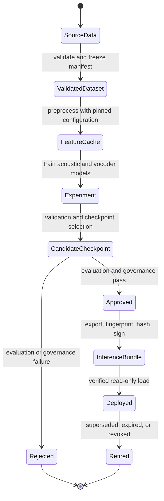

# Artifact lifecycle, versioning, and integrity

## Artifact classes

The project produces four distinct artifact classes:

1. **Dataset manifest:** human-auditable source records and provenance metadata.
2. **Preprocessed features:** mel, tokens, duration, pitch, energy, and compatibility metadata.
3. **Training checkpoint:** resumable model and optimizer state.
4. **Inference bundle:** minimal approved weights, vocabulary, and manifest required by serving.

Do not deploy a training directory directly. Checkpoints contain optimizer state, may be numerous, and
represent an experiment rather than an approved release.

## Identity and fingerprints

A manifest record identity hashes resolved audio path, transcript, and speaker. A dataset report hashes
sorted record identities. This is useful for detecting changes but is not a cryptographic digest of all
audio bytes. Production provenance systems should additionally hash source files and signed metadata.

Audio feature fingerprints hash all `AudioConfig` values. Cache keys also include resolved source path
and modification time. Vocabulary files hash the ordered symbol list. Alignment artifacts record a
source fingerprint, backend, and backend version.

The inference bundle manifest contains:

- format version;
- human/model version;
- tensor-compatibility configuration fingerprint;
- vocabulary checksum;
- authorized speaker and language lists; and
- SHA-256 digest for vocabulary and both weight files.

## Checkpoint semantics

Acoustic checkpoints store model, optimizer, scheduler, AMP scaler, and arbitrary state including epoch,
global step, best validation value, stale epochs, and full configuration fingerprint. Writes go to a
same-directory temporary path, are flushed, and then atomically renamed. A sidecar JSON records size and
SHA-256.

Vocoder checkpoints independently store generator, multi-period discriminator, multi-scale
discriminator, both optimizers, both schedulers, scaler, epoch, and step. Resume verifies its sidecar
before restoring all components.

Atomic rename protects readers from a partially written target on one filesystem. It does not protect
against disk corruption, compromised writers, rollback to an older valid artifact, or a temporary path
on a different filesystem. Production artifact stores should provide immutable versions, retention, and
signed provenance.

## Bundle load transaction

Serving reads `manifest.json`, validates its format, compares the artifact fingerprint, hashes each
declared file, verifies the vocabulary’s internal checksum, constructs modules from current typed
configuration, then loads tensor state with `weights_only=True`. Models become ready only after the
entire sequence succeeds.

`weights_only=True` narrows pickle object construction but does not make arbitrary files trustworthy.
Only accept bundles produced by an authorized build pipeline. Prefer signed manifests and a tensor-only
format when integrating external weights.

## Versioning strategy

Format version describes machine schema and must change when the loader contract changes. Model version
describes a release and should be immutable, meaningful, and traceable to data/model approvals—for
example `english-consented-v3.2.1`. Configuration and vocabulary hashes answer compatibility questions;
semantic release metadata answers governance and rollback questions.

Recommended promotion states are `experiment -> candidate -> approved -> deployed -> retired`. Promotion
should attach evaluation results, data/model cards, consent scope, security scan, reviewer identity, and
deployment limitations. Retiring a speaker or dataset must identify and revoke every derived bundle.

## Migration and rollback

Never overwrite a deployed bundle in place. Export a new immutable directory, validate it offline, load
it in a canary, compare audio/latency/security regressions, and switch traffic by version. Rollback means
route traffic to the prior approved bundle plus compatible application image; rolling back only code or
only weights can violate format contracts.
