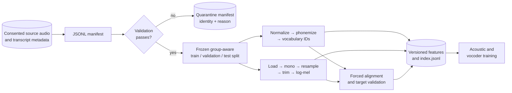

# Data ingestion, validation, splitting, and preprocessing

## 1. Data is the primary model dependency

Speech synthesis learns pronunciations, timing, recording conditions, speaking style, and speaker
identity from data. Architecture cannot compensate for incorrect transcripts, inconsistent segmentation,
bad alignments, or missing consent. Treat the dataset as a versioned product with owners, provenance,
tests, and revocation procedures—not a folder of WAV files.

This chapter describes the implemented JSONL pipeline and the additional controls required for a
production corpus.



## 2. Manifest format

JSON Lines contains one JSON object per line. It supports streaming, diffs, and arbitrary metadata more
cleanly than CSV. Required fields are:

```json
{
  "audio_path": "wavs/000001.wav",
  "transcript": "The requested text as recorded.",
  "speaker_id": "speaker_001",
  "language": "en-US"
}
```

Optional fields are `normalized_transcript`, `duration`, and `metadata`. Relative audio paths resolve
against the manifest directory, making a dataset tree relocatable. Absolute paths are supported but make
reproducibility across machines harder.

Recommended production metadata includes recording/session ID, source corpus/version, license,
consent-record reference, microphone/environment, transcript reviewer, collection date, language
confidence, demographic attributes where lawful and necessary, and exclusion/revocation status. Do not
place secret identity data directly in broadly distributed training manifests.

`speaker_id` is a pseudonymous model-conditioning key. It is not authorization. Serving speaker lists
must be derived from an approved bundle and tenant policy.

## 3. Loading and schema behavior

`load_manifest` reads UTF-8, ignores blank lines, parses each object, and reports a line number for JSON,
missing-field, type, or duration conversion failures. It rejects an entirely empty manifest. Metadata is
copied into a plain dictionary so callers can enrich reports without changing the core schema.

The record identity is SHA-256 over resolved path, transcript, and speaker. This detects duplicate
logical samples under the same path and content. It does not hash audio bytes; copies at different paths
can evade it. A production deduplicator should combine file hashes, acoustic fingerprints, session IDs,
and normalized transcript similarity.

## 4. Validation stages

Validation is intentionally done before GPU work:

1. Reject blank transcripts.
2. Detect duplicate paths/identities.
3. Verify the file exists.
4. Read audio metadata or fail as corrupt/unsupported.
5. Check duration bounds.
6. Warn when sample rate requires resampling.
7. Warn about unusual channel counts.
8. Aggregate speaker counts, total duration, and dataset fingerprint.

The report separates errors from warnings. A sample-rate mismatch is a warning because the processor has
a defined resampler; an empty transcript is an error because there is no learning target. The caller
decides whether warnings become release-blocking policy.

Run:

```bash
tts validate-dataset data/corpus/manifest.jsonl --config configs/base.yaml
```

The command exits nonzero when errors exist, making it usable in a data CI pipeline.

Production checks should additionally cover amplitude/clipping, DC offset, silence ratio, transcript-
audio language agreement, text/audio duration ratio, encoding consistency, duplicate recording content,
profanity/policy labels, consent scope, and speaker/session balance.

## 5. Duration filtering

Very short clips often contain clicks, partial phonemes, or annotation mistakes. Very long clips increase
alignment failure and batching variance. Defaults accept 0.1–30 seconds, but a clean single-sentence
corpus often uses a tighter range after inspecting distributions.

Filtering must be explainable and recorded. Never silently remove a demographic/language slice because
its recording style produces longer clips. Report count and duration by rejection reason and speaker.

## 6. Reproducible splitting and leakage

`split_manifest` groups by speaker, sorts by stable identity, applies a seeded shuffle, and allocates
rounded validation/test counts within each speaker. This preserves speaker coverage for a multi-speaker
model and makes repeated calls deterministic.

It prevents the exact record object from appearing twice, but path identity alone is not sufficient for
serious leakage prevention. Consecutive clips from one recording session share noise, microphone, and
prosody. Near-duplicate takes can appear under different paths. Depending on evaluation objective:

- split by session or source recording for generalization to new utterances;
- hold out entire speakers to evaluate unseen-speaker adaptation; or
- retain speakers across splits to evaluate a closed multi-speaker synthesizer.

Choose the policy before training and encode group IDs in metadata. Never tune on the test set.

## 7. Vocabulary construction

`tts build-vocabulary` normalizes and phonemizes each transcript, observes all symbols, prepends fixed
special symbols, sorts the rest, and writes a checksum. Building vocabulary after splitting can create
unknown test phonemes; building on all text reveals only symbol inventory, but some evaluation policies
consider that test leakage. Decide and record the policy.

Changing normalizer, phonemizer version, language, or vocabulary ordering invalidates token caches and
acoustic weights even when the displayed transcript is unchanged.

## 8. Preprocessing flow

For every accepted record, `preprocess_records`:

1. uses provided normalized text or normalizes the transcript;
2. phonemizes and adds BOS/EOS token IDs;
3. loads, converts to mono, resamples, trims, and peak-normalizes waveform;
4. extracts a log-mel spectrogram shaped `[M,F]`;
5. obtains integer durations shaped `[T]` from the alignment backend;
6. computes frame energy and averages it within token durations;
7. creates token pitch targets;
8. writes alignment JSON and compressed feature arrays; and
9. writes a preprocessed index referencing those arrays.

The current fixture path sets pitch targets to zero because it does not bundle an F0 estimator. This is
a deliberate limitation, not production pitch extraction. A real pipeline should configure a voiced-F0
backend (for example, a pinned robust estimator), define unvoiced values, normalize targets consistently,
and version the estimator in cache identity.

The command refuses to proceed without explicit fixture authorization because no production aligner is
configured:

```bash
tts preprocess manifest.jsonl processed vocabulary.json --fixture-alignment
```

Use this only to test software flow. See [alignment](alignment.md).

## 9. Preprocessed tensor contract

Each `.npz` contains:

| Array | Shape | Dtype | Meaning |
|---|---:|---|---|
| `tokens` | `[T]` | int64 | vocabulary IDs including boundaries |
| `durations` | `[T]` | int64 | mel frames allocated to each token |
| `pitch` | `[T]` | float | token-level pitch target |
| `energy` | `[T]` | float | token-level mel-norm energy |
| `mel` | `[M,F]` | float | log-mel feature |

It also records feature fingerprint and vocabulary checksum. The dataset transposes mel to `[F,M]` for
the acoustic model. Collation pads tokens and frames independently and records token lengths; padded
durations/pitch/energy/mel are zero.

Before training, verify all cached compatibility values rather than trusting filenames. The current
dataset loader is intentionally compact and does not yet perform every checksum check at read time; an
artifact promotion pipeline should validate the complete index once and make the cache read-only.

## 10. Bucketing and batching

Padding cost depends on the longest token and mel sequence in a batch. Random fixed-size batches can
waste memory when durations vary widely. The reference DataLoader is simple; production training should
bucket by mel or token length, optionally use a maximum-frame budget per batch, and preserve randomized
bucket order. Distributed samplers must assign each sample exactly once per epoch and seed by epoch.

## 11. Public dataset example

LJSpeech is a familiar single-speaker English dataset whose metadata can be converted to this manifest.
It is mentioned only as a format example. Verify the dataset’s current license, speaker-use expectations,
and suitability for your jurisdiction and product at acquisition time. Do not treat “publicly
downloadable” as equivalent to consent for every synthetic-voice use.

`scripts/download_example_data.py` accepts an operator-reviewed HTTPS URL and expected SHA-256, validates
the checksum, and rejects path traversal during extraction. It deliberately does not hard-code or
silently download a corpus.

## 12. Data change checklist

- Record provenance, license, consent, access, retention, and revocation.
- Freeze manifest and source hashes.
- Review validation and distribution reports by speaker/language/session.
- Define split groups and seed; store resulting manifests.
- Pin normalizer, phonemizer, aligner, F0 estimator, and audio configuration.
- Quarantine failures with reason codes.
- Version vocabulary, feature cache, and alignments.
- Run listening spot checks before training.
- Update the data card and identify all downstream artifacts for deletion if consent changes.
