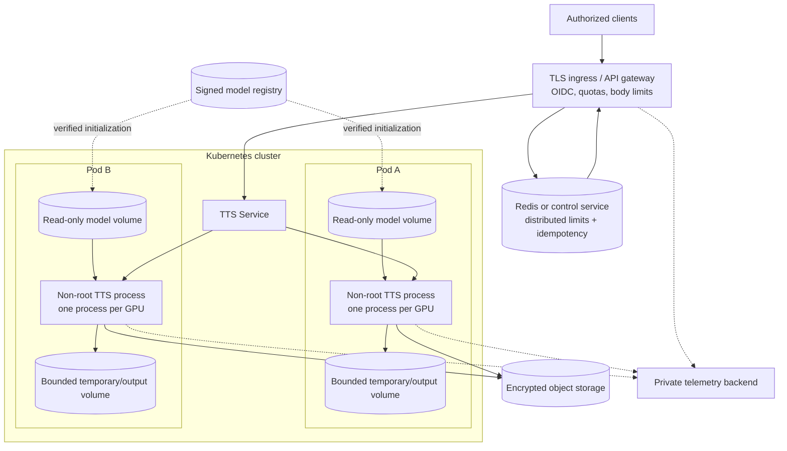

# Deployment and capacity engineering

## 1. Deployment artifact set

A deployable release is an immutable application image, immutable approved model bundle, validated
configuration, secret references, and release evidence. Do not bake private model weights or API keys
into a public image. Code and bundle versions must be rolled forward/back together when format contracts
change.

## 2. Local process deployment

Install Python 3.11+, libsndfile, and optional espeak-ng, then editable/package dependencies. Export or
mount a bundle compatible with resolved configuration:

```bash
export TTS_MODEL_DIR=/srv/tts/models/english-v1
export TTS_API_KEY='from-a-secret-manager-in-real-deployments'
tts validate-config --config configs/base.yaml
tts serve --config configs/base.yaml
```

Use a process supervisor for restart, file-descriptor limits, graceful termination, and stdout log
collection. Uvicorn development launch is not TLS termination.

## 3. CPU container

`docker/Dockerfile` uses Python 3.11 slim, installs libsndfile/espeak, installs the package, creates UID
10001, and runs through an `exec` entrypoint so signals reach the server. Compose mounts artifacts,
drops capabilities, enables `no-new-privileges`, uses a read-only root and bounded tmpfs, and probes
`/ready`.

Because the root is read-only, configured local output storage under model directory requires that mount
to be writable. If bundles must be read-only—and they should—mount a separate writable output volume or
disable storage responses. Do not make model weights writable merely to satisfy output storage.

## 4. GPU container

The GPU Dockerfile starts from a PyTorch CUDA runtime. CUDA driver on host must support container CUDA;
PyTorch and torchaudio versions must match. Build arguments and unpinned auxiliary installs should be
converted to an organization-verified lock/image digest for production.

Allocate one serving process per GPU by default. Multiple workers duplicate weights and compete for CUDA
memory/streams. Use NVIDIA container runtime/device requests and monitor allocation plus inference peaks.

## 5. Kubernetes reference design

A pod should have:



- one model-serving container;
- explicit CPU/memory and optional one-GPU requests/limits;
- non-root UID, read-only root, seccomp RuntimeDefault, no privilege escalation, dropped capabilities;
- model bundle mounted read-only from an immutable image/volume or initialized from verified storage;
- separate writable tmp/output volume if required;
- API key/identity credentials through secrets workload identity, never environment committed to Git;
- startup/readiness on `/ready` and liveness on `/health`;
- termination grace long enough to drain or reject in-flight synthesis; and
- restrictive ingress/egress NetworkPolicy.

Use a startup probe for slow model hash/load/warm-up so liveness does not kill a healthy initialization.
Readiness removal should precede termination. The current application does not implement explicit queue
drain; ingress and termination grace must account for request timeout.

## 6. Capacity model

Measure model resident memory, peak per request by token/output length, and framework overhead. Safe
concurrency is bounded by memory and latency, approximately:

`resident + concurrency * peak_request + safety_margin < device_capacity`.

This is only a planning equation because kernels/caches reuse memory and requests vary. Load test actual
distributions. CPU capacity must include phonemization/resampling/encoding and avoid PyTorch/OpenMP thread
oversubscription across workers.

Scale on queue wait, active synthesis, p95/p99 latency, timeout/503 rate, RTF, and GPU utilization/memory.
CPU alone can be low while GPU queue is saturated.

## 7. Rolling release

1. Build image and bundle as immutable versions.
2. Verify hashes, signatures/provenance, vulnerabilities, and config compatibility offline.
3. Run deterministic smoke, quality regression, and capacity tests.
4. Start canary with zero/low traffic; wait for readiness and warm representative shapes.
5. Compare error, latency, audio, safety metrics against current release.
6. Increase traffic gradually while preserving rollback capacity.
7. Retain previous approved code+bundle until rollback window closes.

During rolling updates, old and new pods coexist; ensure nodes can hold both models. A rollout that
overcommits GPU memory can make every new pod unready and reduce existing capacity.

## 8. Rollback and disaster recovery

Rollback routes traffic to the prior immutable image and bundle. Practice it. Preserve config/secret
compatibility and do not overwrite version tags. If artifact integrity fails, stop promotion rather than
copying around verification.

Back up governance metadata, approved manifests, model/data cards, and experiment references. Training
checkpoints are optional for serving recovery but necessary to resume research. Test restore and hash
verification, not only backup creation.

## 9. Cloud object/model storage

Download bundles only in a controlled initialization stage with TLS, identity, version pin, expected
digest/signature, size limit, and atomic local promotion. Serving must not accept a request-supplied model
URI. Cache on node only if access, encryption, and revocation are understood.

Generated output storage needs tenant prefixes generated by server, encryption, limited signed URLs,
short retention by default, deletion/consent handling, malware/MIME policy where uploads exist, and audit
events without text content.

## 10. Environment promotion checklist

- Python/PyTorch/CUDA/libsndfile/espeak versions verified.
- Resolved config and artifact fingerprint recorded.
- Bundle hash/signature and speaker authorization approved.
- Secrets and TLS valid; authentication enabled.
- Read-only/writable mounts separated.
- Probes, limits, disruption budget, and network policy installed.
- Warm-up and capacity/concurrency measured.
- Dashboards/alerts and on-call runbook active.
- Canary and rollback completed.
- Responsible-use and retention controls tested.
