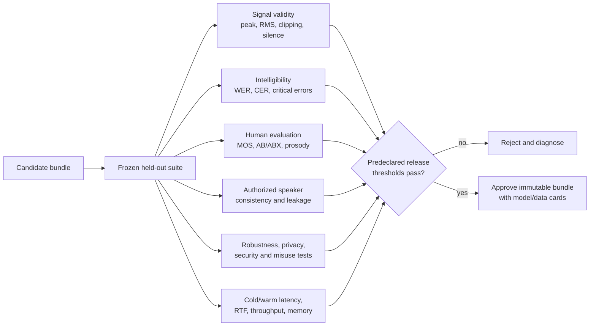

# Evaluation and benchmarking

## Why evaluation is multi-dimensional

No single metric means “good TTS.” A model may sound natural but omit words, pronounce text correctly
but sound robotic, imitate a consented speaker while generating artifacts, or achieve low average
latency while failing under concurrency. Release decisions need quality, intelligibility, speaker,
robustness, performance, safety, and fairness evidence.

## Dataset design

Maintain a held-out evaluation manifest that is never used for training, early stopping, vocabulary
selection, or manual prompt tuning. Stratify by speaker, sentence length, punctuation, numbers, dates,
currency, acronyms, rare phonemes, and out-of-domain content. Add adversarial text cases without adding
private or abusive content to permanent logs.

Use frozen test IDs for release comparison. If normalization behavior changes, report both the old and
new expected reading; otherwise an apparent acoustic regression may actually be a text-policy change.

## Signal metrics implemented by the CLI

`tts evaluate <wav>` reports:

- duration in samples divided by sample rate;
- peak absolute amplitude;
- RMS amplitude `sqrt(mean(x^2))`;
- clipping fraction where `abs(x) >= 0.999`;
- silence fraction where `abs(x) < 1e-4`; and
- optional RTF when processing latency is supplied.

These detect empty, clipped, overly quiet, and slow output. They do not measure naturalness,
pronunciation, or speaker similarity.

## Intelligibility

Run a high-quality ASR system on generated held-out utterances and compute word error rate:

`WER = (substitutions + deletions + insertions) / reference_words`.

Normalize ASR references consistently, publish the ASR model/version, and manually inspect high-error
cases because ASR has its own accent and demographic biases. Character error rate is helpful for names
and languages without whitespace segmentation. Track omission/repetition separately for long text.

## Naturalness and preference

Use blinded human Mean Opinion Score with a defined scale, randomized utterance order, reference
anchors, headphone/environment guidance, and confidence intervals. Report participant count and ratings
per sample. Pairwise AB/ABX tests are more sensitive for comparing two versions. Do not ask raters to
identify real people or expose speaker private information.

## Speaker and prosody evaluation

For authorized multi-speaker models, measure embedding similarity with a separately validated speaker
encoder and compare against within-speaker and between-speaker distributions. Similarity is not identity
proof and can encourage unsafe cloning objectives; use it only inside the consent scope.

Pitch correlation/RMSE should exclude or explicitly encode unvoiced frames. Duration error should be
reported per token and per utterance. Energy error depends on the exact feature definition. Human prosody
ratings should cover emphasis, pace, phrasing, and punctuation.

## Performance methodology

Measure cold load separately from first synthesis and steady-state warm calls. Record hardware, thread
counts, model version, precision, sample rate, input/token/output lengths, and concurrency. Report median,
p90, p95, and p99 latency—not only mean. RTF is per utterance; throughput is completed audio seconds or
requests per wall-clock second. A system can have excellent RTF but poor short-request latency.

`tts benchmark` records cold iteration, later warm iterations, output duration, RTF, Python/device, and
peak CUDA allocation when available. For production capacity, drive the HTTP API with controlled
concurrency and measure queue wait, overload responses, memory, and tail latency.

## Robustness and regression

Test empty/control input rejection, maximum lengths, Unicode compatibility forms, unknown symbols,
pathological punctuation, very large numbers, mixed scripts, unknown speakers, invalid controls,
corrupted bundles, and concurrent overload. Keep deterministic normalization snapshots and signal-level
goldens with tolerances. Exact neural waveform equality across hardware is often too brittle; compare
features, metadata, duration, finiteness, and bounded numerical differences.

## Release gate example

A real release gate might require no integrity/security failures, zero missing-word critical cases,
WER below an agreed threshold per supported slice, statistically non-inferior MOS, clipping below a
small limit, p95 latency and RTF within capacity targets, successful rollback rehearsal, and completed
model/data/responsible-use reviews. Thresholds are product- and language-specific and must be agreed
before examining candidate results.
