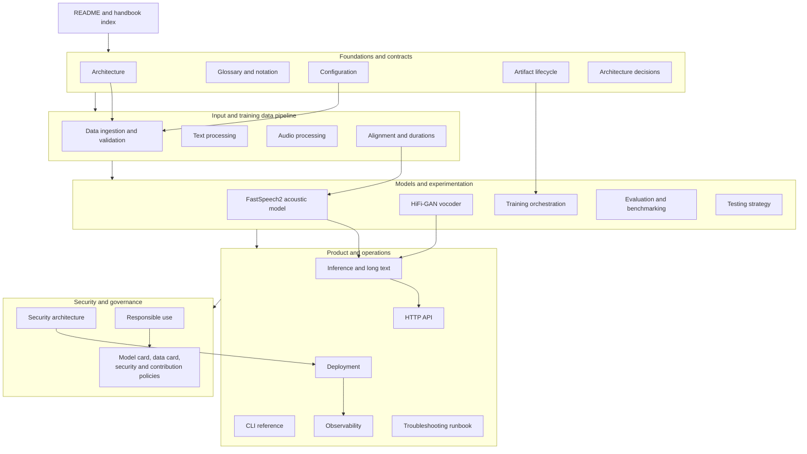

# TTS engineering handbook

This directory is the long-form technical reference for the project. It is written for two readers:

- an engineer encountering speech synthesis for the first time, who needs concepts built from first
  principles; and
- a future maintainer who needs exact contracts, assumptions, failure modes, and operational procedures
  without reverse-engineering the repository.

The documentation describes the code that exists today. When it discusses a recommended production
extension—such as Montreal Forced Aligner, Redis, object storage, or perceptual watermarking—it labels
that extension explicitly. Nothing described as a future integration should be mistaken for implemented
behavior.

## Handbook structure

## Recommended reading paths

For a first end-to-end understanding, read in this order:

1. [Architecture](architecture.md): boundaries, training and inference flows, and design invariants.
2. [Configuration](configuration.md): how every subsystem is parameterized and compatibility is checked.
3. [Data pipeline](data-pipeline.md): manifest schema, validation, splitting, preprocessing, and caching.
4. [Text processing](text-processing.md): normalization, phonemization, vocabulary, and language limits.
5. [Audio processing](audio-processing.md): waveform representation, STFT, mel features, and resampling.
6. [Alignment](alignment.md): where duration targets come from and why fixture alignment is not training
   data.
7. [Acoustic model](acoustic-model.md): FastSpeech2 tensor flow, variance controls, masks, and losses.
8. [Vocoder](vocoder.md): HiFi-GAN generation, discriminators, and adversarial optimization.
9. [Training](training.md): reproducibility, checkpoints, optimization, validation, and recovery.
10. [Inference](inference.md): model bundle loading, long text, post-processing, and determinism.
11. [API](api.md): HTTP contracts, concurrency, timeouts, idempotency, and errors.
12. [Evaluation](evaluation.md): objective, subjective, latency, robustness, and regression methodology.
13. [CLI reference](cli.md): every command, artifact, caveat, and automation practice.
14. [Testing strategy](testing.md): test layers, numerical policy, and maintenance guidance.

For production ownership, continue with:

- [Artifact lifecycle](artifacts.md)
- [Deployment](deployment.md)
- [Observability](observability.md)
- [Security](security.md)
- [Responsible use](responsible-use.md)
- [Troubleshooting](troubleshooting.md)

For vocabulary and notation, use the [glossary](glossary.md). Architectural decisions live under
[`docs/adr`](adr/0001-model-architecture.md). The root [model card](../MODEL_CARD.md),
[data card](../DATA_CARD.md), and [security policy](../SECURITY.md) are governance records rather than
substitutes for the technical chapters.

## Documentation conventions

Tensor dimensions use these symbols consistently:

| Symbol | Meaning |
|---|---|
| `B` | batch size |
| `T` | padded token sequence length |
| `F` | padded mel-frame length |
| `H` | acoustic-model hidden dimension |
| `M` | number of mel bins |
| `S` | waveform samples |
| `N` | FFT size |
| `HOP` | STFT hop length in samples |

Shapes are batch-first unless explicitly stated. A mask described as “valid” contains `True` at real
positions; a “padding mask” contains `True` at padding positions because PyTorch attention expects that
polarity.

Shell examples assume execution from the repository root, an activated Python 3.11+ environment, and
an editable installation (`python -m pip install -e '.[dev]'`). Paths beginning with `/app` refer to the
container image. Development-only commands are labelled as such.

## Maintaining this handbook

A code change must update the relevant chapter when it changes a public schema, tensor shape,
configuration field, artifact format, command, endpoint, security boundary, or operational assumption.
Compatibility-breaking changes also require a changelog entry and, when architectural, a new ADR.
Examples should be executable or directly derived from tests. Never document a control as implemented
unless a test or code path demonstrates it.
