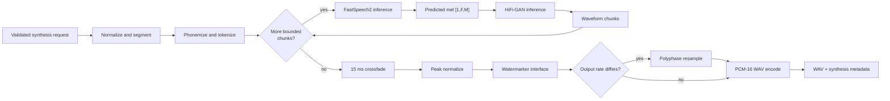

# Inference pipeline and long-text synthesis

## 1. Model load and readiness

`Synthesizer.from_directory` chooses configured PyTorch device and calls the transactional bundle loader.
Hashes, format, artifact fingerprint, and vocabulary checksum are checked before modules enter eval mode.
Any failure leaves API readiness false. Serving never downloads missing assets.

The synthesizer owns normalizer, phonemizer, audio processor, tracer, and watermarker adapters. Defaults
are automatic phonemization, no-op tracing, and no-op watermarking; production should inject explicit
backends based on policy.

## 2. Request controls

Library synthesis accepts text, language, speaker, rate, pitch, energy, optional output rate, seed,
request ID, and cancellation callback. Language/speaker must exist in bundle metadata. Rate/pitch/energy
must be finite within 0.5–2.0; output rate must be 8–48 kHz. These checks protect non-HTTP callers too.

A seed is applied to all RNGs. Eval/inference mode removes dropout and should make ordinary CPU inference
stable, but exact cross-hardware equality is not promised.

## 3. Text-to-token stages

Input is normalized, segmented by sentence boundaries, phonemized per sentence, encoded with BOS/EOS,
and bounded by token limit. Text tracing receives only counts/language as span attributes, never content.

If a sentence exceeds the limit, token windows remove nested boundary IDs and add fresh BOS/EOS. This
protects memory but can break prosody mid-phrase. A richer production segmenter should pack clauses to a
token budget and preserve abbreviation/quote context.

## 4. Chunk model execution

Each token list becomes `[1,T]`; speaker/language names map to bundle-list indices. FastSpeech2 predicts
mel in inference mode, then HiFi-GAN generates waveform. Acoustic/vocoder tracing records token/frame
counts only. Cancellation is checked between chunks; the current neural forward is not interruptible in
the middle of one chunk.

One failed chunk currently fails the entire request. This avoids silently dropping words. An optional
partial mode would need explicit per-chunk status and should not be the default for speech content.

## 5. Boundary handling

Waveform chunks are joined with 15 ms linear crossfade. Crossfade reduces clicks caused by independently
generated boundaries but overlaps content and can smear consonants if segmentation is poor. The current
path does not insert explicit silence; terminal punctuation must be represented through model prosody.

For higher quality, compare crossfade, model-generated punctuation pauses, and explicit configurable
silence on held-out long text. Do not concatenate WAV containers; concatenate float waveforms before one
final encoding.

## 6. Post-processing

Combined waveform is peak-scaled to 0.95 when non-silent, passed to `Watermarker.apply`, resampled if a
different output rate was requested, clamped, and encoded PCM-16 WAV. Watermark runs at canonical model
rate so an implementation can use stable signal assumptions; it must survive allowed resampling if that
is a policy requirement.

Peak scaling is not loudness mastering. It prevents clipping but utterances may differ perceptually.

## 7. Metadata

Result reports request ID, audio duration, input character count, token count, processing latency, RTF,
model version, output sample rate, speaker, language, and optionally normalized text. Audio duration is
measured at canonical samples before output resampling and should remain equivalent apart from resampler
rounding.

Normalized text is omitted unless `serving.expose_normalized_text=true`. It can contain sensitive input
and should not be added to logs merely because it appears in a development response.

## 8. Why arbitrarily long input is unsafe

Long text increases normalization/phonemizer cost, attention memory roughly quadratically in token count,
duration-expanded decoder memory, waveform memory, response size, GPU occupancy, timeout probability,
and blast radius of a single error. It also worsens prosody because paragraph-level structure exceeds
the model’s learned context.

Controls are layered: character limit, request-body limit, sentence segmentation, token-window limit,
position limit, duration cap/scaling, bounded concurrency, queue timeout, and request timeout. No one
limit is sufficient.

## 9. Streaming semantics

`/v1/synthesize/stream` currently performs synthesis first, then yields the valid WAV bytes in 64 KiB
HTTP chunks and checks disconnect between chunks. This reduces client buffering requirements but not
time-to-first-audio. It is accurately described as chunked delivery, not incremental neural synthesis.

True low-latency streaming needs a container/header strategy, incremental text segmentation, acoustic
chunk scheduling, vocoder receptive-field overlap/state, ordered backpressure, cancellation propagation,
and boundary quality evaluation. Adding it is an architectural feature, not changing generator yield
size.

## 10. Performance practices

Keep models resident, warm representative shapes before readiness, use `torch.inference_mode`, avoid
repeated preprocessing and waveform copies, and benchmark thread/GPU behavior. `torch.compile` can help
stable shapes but increases startup and recompilation risk for variable text; measure candidate shape
buckets. AMP may improve GPU throughput but requires audio regression tests.

Batching multiple requests improves GPU utilization at the cost of queue latency and more complex
speaker/control/mask handling. Use a maximum-wait batching policy only after measuring user latency.

## 11. Failure diagnosis

Separate stages: normalization output, symbols/IDs, duration predictions/clamp rate, mel distribution,
ground-truth-mel vocoder quality, chunk boundaries, and encoding. A correct WAV header containing noise
means the pipeline worked but weights are untrained; it is not evidence of model quality.

Bundle/load errors are deployment issues. Unknown speaker/language and invalid controls are request
issues. NaN/shape/position errors are model or artifact issues and should page operators if they occur
with an approved bundle.
