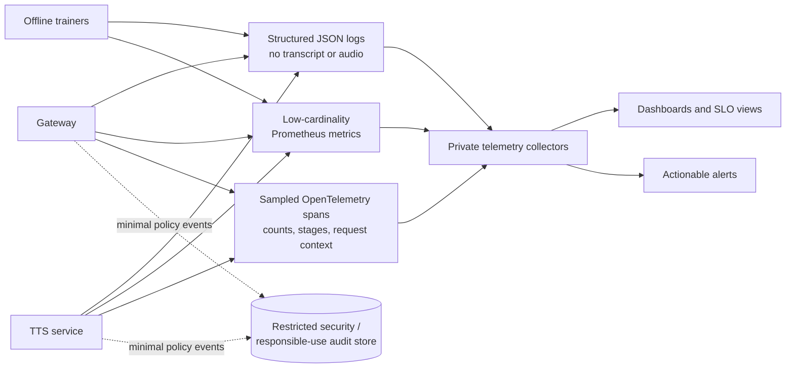

# Logging, metrics, tracing, and alerting

## 1. Observability goals

Operators need to answer: Is a model loaded? Are requests succeeding? Where is latency spent? Is the
queue saturated? Is output generation slower than real time? Did an artifact fail integrity? Is abuse or
unexpected volume occurring? They should answer without collecting transcripts, raw audio, API keys, or
high-cardinality speaker/user labels.

## 2. Structured logging

`JSONFormatter` emits UTC ISO timestamp, level, logger, message, and selected structured extras:
request ID, latency seconds, status code, and model version. Exception stacks are included for internal
logs when `exc_info` is present. A redaction set removes known sensitive field names, but redaction is not
a license to attach arbitrary request dictionaries—the message itself could still leak data.

Logging policy:

- log request IDs and numeric sizes, never input content;
- do not log headers or full Pydantic models;
- use pseudonymous tenant identifiers only if necessary and access-controlled;
- separate security/audit retention from debug logs;
- control access, encryption, regional location, and deletion; and
- sanitize unexpected exception messages before client exposure.

Set `TTS_LOG_LEVEL`; production normally uses INFO, with sampled DEBUG only under controlled incident
response.

## 3. Prometheus metrics implemented

| Metric | Type | Meaning |
|---|---|---|
| `tts_requests_total{endpoint,status}` | counter | completed/failed route classifications |
| `tts_synthesis_seconds` | histogram | synthesis processing latency |
| `tts_active_syntheses` | gauge | model work currently admitted |
| `tts_characters_total` | counter | aggregate accepted input characters |

Prometheus client also exposes process/runtime metrics. Metric labels are deliberately low cardinality.
Do not label by request ID, text, raw speaker, tenant, object key, or exception string.

Current metric coverage can be expanded with queue-wait histogram, output audio seconds, RTF, token/frame
histograms, model-load result/duration, duration-clamp count, timeout/disconnect, and storage outcomes.
Use bounded buckets appropriate to service objectives.

## 4. Tracing interface

`Tracer.span(name, attributes)` is injected into synthesizer. No-op is offline default. Optional
`OpenTelemetryTracer` wraps the API tracer and currently creates `tts.text`, `tts.acoustic`, and
`tts.vocoder` spans with character/token/frame counts and language—not content.

In a full deployment, instrument HTTP middleware, queue wait, model load, audio post-processing,
resampling/storage, and external identity/object-store calls. Propagate W3C trace context only through
trusted gateways. Apply sampling and attribute allowlists; trace backends are data processors.

## 5. Dashboards

An operational dashboard should show:

- ready replicas versus desired;
- request rate and status by endpoint;
- queue wait and active versus configured concurrency;
- p50/p95/p99 processing latency and RTF;
- output duration/token/frame distributions;
- CPU, RSS, GPU utilization/memory, and restarts;
- model version/load failures and integrity errors; and
- rate-limit, timeout, disconnect, and abuse-review signals.

Overlay deployments and model-version changes so regressions have context.

## 6. Alert design

Alerts should be actionable and tied to user impact. Examples:

- no ready replicas for 2 minutes: page;
- 5xx/timeout rate above SLO with minimum volume: page;
- p95 latency or queue wait sustained above objective: page or scale;
- GPU memory near limit plus active saturation: capacity alert;
- artifact integrity/model-load failure during rollout: stop rollout and page;
- rate-limit surge or abnormal character/audio volume: security/abuse review;
- training NaN/checkpoint integrity failure: experiment owner alert, not serving page.

Avoid paging on a single cold start or low-volume percentile noise. Include runbook links, model version,
deployment, and query in alert annotations.

## 7. Service-level objectives

Define separate availability and latency indicators. `/health` success is not user availability if
`/ready` is false. A synthesis SLI might count eligible requests that complete successfully within a
latency objective, excluding clearly invalid/unauthorized input but including overload if capacity is the
service’s responsibility.

Latency objective should be segmented by allowed input/output duration or use RTF plus fixed overhead;
one absolute threshold across “Hi” and a five-minute paragraph is misleading.

## 8. Incident investigation

Start from deployment/model version and readiness, then request status/queue, resource saturation, stage
traces, and artifact logs. Reproduce with synthetic/non-sensitive text. If one customer sample is needed,
obtain authorized access through a privacy-reviewed channel rather than asking them to paste it into a
public issue. Record timeline, impact, root cause, and corrective tests.
