# Responsible use, consent, and abuse prevention

## 1. Policy principle

The ability to synthesize a voice is not permission to use that voice. Technical access must follow
explicit, informed, specific authorization from the speaker or lawful rights holder and must remain
within the consented purpose. Public availability of recordings is not equivalent to voice-model consent.

```mermaid
flowchart LR
    Speaker["Speaker / rights holder"]
    Consent["Verified informed consent<br/>scope + expiry + revocation"]
    Dataset["Controlled dataset<br/>with provenance lineage"]
    Training["Approved training run"]
    Evaluation["Quality, safety, bias,<br/>security review"]
    Bundle["Restricted speaker bundle"]
    Authorization["Per-tenant speaker and<br/>purpose authorization"]
    Synthesis["Synthesis with quotas,<br/>audit and disclosure controls"]
    Revocation{"Consent revoked,<br/>expired, or violated?"}
    Retire["Block access, retire bundles,<br/>delete/retain by policy, record evidence"]

    Speaker --> Consent --> Dataset --> Training --> Evaluation --> Bundle
    Bundle --> Authorization --> Synthesis --> Revocation
    Revocation -- "no" --> Synthesis
    Revocation -- "yes" --> Retire
    Consent -.->|lineage and policy| Revocation
```

## 2. Speaker enrollment requirements

Before adding a speaker ID or training data, record:

- verified speaker/representative identity and authority;
- exact data sources and ownership/license;
- informed consent covering training and synthetic output;
- allowed products, audiences, territories, languages, and content categories;
- whether adaptation, redistribution, or sublicensing is allowed;
- disclosure/watermark and human-review expectations;
- compensation where applicable;
- retention, access, expiration, revocation, and deletion process; and
- special considerations for minors, vulnerable persons, deceased speakers, and union/contract terms.

Consent should be understandable and revocable where promised. Keep sensitive identity evidence separate
from broad ML manifests; link it through controlled records.

## 3. Prohibited uses

Do not use the project for non-consensual cloning, deceptive impersonation, fraud/social engineering,
harassment, defamation, biometric authentication bypass, fabricated evidence, undisclosed political
persuasion, evading platform disclosure, or other unlawful/harmful activity. Do not provide a workflow
that converts scraped/private real-person recordings into a covert clone.

## 4. Authorization enforcement

Bundle speaker lists are release metadata, not sufficient access control. Production must map authenticated
tenant/user claims to specific speaker/model/purpose permissions and deny by default. Restricted/high-risk
speakers should require additional approval or be unavailable. Separate enrollment/export roles from
ordinary synthesis.

Rate limits should consider tenant, speaker, purpose, output duration, and risk—not only IP. Apply tighter
limits to new accounts and high-risk contexts. Detect key sharing and unusual distributed traffic while
respecting privacy.

## 5. Disclosure and watermarking

The `Watermarker` protocol is an integration point; `NoopWatermarker` changes nothing. Deployments that
promise watermarking must inject a reviewed implementation and test audibility, robustness to allowed
resampling/encoding/editing, false positives, key security, and accessibility. Watermarking can fail or
be removed and does not replace consent, authorization, or clear user-facing disclosure.

Use content metadata or audible disclosure where appropriate and preserve model/version provenance in
authorized output systems. Avoid implying an infallible detector.

## 6. Abuse monitoring and audit

Collect the minimum privacy-preserving events needed: authenticated tenant, authorized speaker/model,
timestamp, request/output size, decision, and policy reason—not transcript by default. Establish alerts
for sudden volume, many identities, repeated restricted attempts, suspicious destinations/patterns where
lawful, and watermark/disclosure failures. Human reviewers need training, access controls, and escalation
procedures.

Provide user/reporting channels, emergency suspension, investigation preservation rules, appeal where
appropriate, and law-enforcement/legal processes consistent with policy and jurisdiction.

## 7. Data and model revocation

Maintain lineage from source recordings through manifests, features, alignments, checkpoints, and
bundles. On revocation, determine legal/contract scope, stop future synthesis, remove speaker from active
authorization, retire affected bundles, delete data/artifacts as required, propagate to backups under
policy, and record completion. Without lineage, deletion claims cannot be substantiated.

## 8. Evaluation for harm

Red-team impersonation scenarios without targeting uninvolved real people. Evaluate authorization
bypass, speaker enumeration, shared-secret abuse, misleading content, watermark removal, language
evasion, rate-limit distribution, and operator misuse. Review demographic/language quality disparities:
poor intelligibility or accent distortion can create exclusion even in consented use.

## 9. Example and fixture policy

Repository fixtures are generated sine waves with metadata marking synthetic source and no real speaker.
Documentation may mention public datasets as format examples but does not assert blanket suitability.
Screenshots, demo audio, and model releases must use synthetic, public-domain, properly licensed, or
explicitly consented voices within their allowed scope.

## 10. Deployment review questions

- Whose voice is represented, under what exact evidence and scope?
- Who can request it, and how is that permission enforced technically?
- What content/purpose is prohibited and what happens on violation?
- What disclosure is promised, and has it been tested end to end?
- What is logged, retained, accessible, and deletable?
- How are abuse reports, emergency shutdown, and revocation handled?
- Can the system be truthfully explained to the speaker and affected users?

If these questions lack concrete owners and answers, do not deploy the voice.
