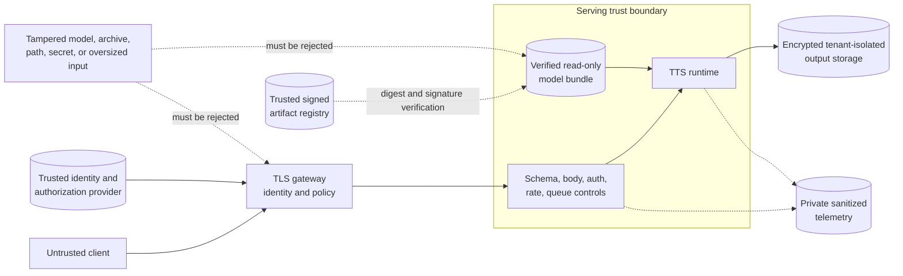

# Security architecture and threat model

## 1. Assets and trust boundaries

Assets include private input text, generated audio, speaker identities/consent records, model weights,
training data, credentials, availability/GPU capacity, and audit evidence. Trust boundaries are client to
gateway, gateway to service, service to model/output storage, offline data jobs to artifact registry, and
artifact registry to deployment.

The service assumes local configuration and approved model directory are trusted. Public request data is
untrusted. External weights, manifests, archives, and storage responses remain untrusted until verified.

## 2. Threat categories

### Resource exhaustion

Attackers can send long Unicode, expensive phonemization, duration-exploding model inputs, many
concurrent calls, large response formats, or slow connections. Controls include body/text/token/position/
duration/output-rate bounds, token bucket, semaphore, queue/request timeout, and gateway limits. Predicted
durations are clamped and total expansion bounded.

### Path traversal and file access

Public API accepts no filesystem path. Manifest paths are offline operator inputs. Local output names are
content hashes resolved beneath a configured root. Archive download script verifies every extraction
target. Never add request-selected model/audio/output paths without a dedicated safe abstraction.

### Artifact tampering and deserialization

Bundles/checkpoints have SHA-256 sidecars/manifests and use `weights_only=True`. Hashes detect accidental
or malicious modification only when the expected manifest itself is trusted. Use signed provenance,
immutable registry permissions, trusted builders, vulnerability scanning, and tensor-only formats where
possible. Never load a user-uploaded checkpoint in the serving process.

### Secret leakage

API keys come from environment/secret manager and are constant-time compared. Logs redact known fields
and do not record headers/text. Environment variables can still be visible to process/debug tooling;
workload identity or mounted secret files may be preferable. Rotate and scope credentials.

### Text and voice privacy

Input may contain health, financial, or identity data. Disable normalized-text responses, minimize output
retention, encrypt transit/at rest, control operator access, define deletion, and avoid text in traces,
metrics, or error messages. Generated audio is sensitive even when text is not because voice can reveal
speaker choice and intended use.

### Voice misuse

Authentication alone does not stop authorized-account abuse. Require speaker consent and per-tenant
speaker authorization, enforce restricted-speaker lists, quotas, disclosure/watermark policy, anomaly
monitoring, terms, reporting, and revocation. See [responsible use](responsible-use.md).

## 3. Input and HTTP controls

Pydantic forbids extra fields and bounds values; normalizer rejects controls and emptiness. Middleware
checks `Content-Length`, but chunked bodies need proxy/server enforcement. Restrict content type to JSON
at gateway, set header/count/time limits, and configure trusted proxy headers to avoid spoofed client
identity.

Error responses should reveal enough to correct input but not internal paths, stack traces, secret
presence, or model architecture details beyond public discovery policy.

## 4. Authentication versus authorization

The implemented shared API-key hook proves possession of one secret. It does not identify a human,
tenant, purpose, or speaker entitlement. A production identity layer must validate issuer/audience/time,
map identity to tenant, and enforce model/speaker/action scopes. Default deny unknown/restricted speakers.
Administrative enrollment/export endpoints, if added, require stronger roles and separate audit.

## 5. Container and runtime hardening

Run non-root, read-only root, dropped capabilities, no privilege escalation, seccomp, resource limits, and
minimal network egress. Mount model read-only and output separately. Patch base images/dependencies and
pin image digests. Protect metrics/admin networks. GPU device access is powerful; isolate untrusted
workloads and avoid sharing a GPU across security tenants without a risk assessment.

## 6. Supply chain

CI performs dependency audit and filesystem/container scanning. Improve with locked hashes per platform,
SBOM, signed commits/tags/images/bundles, protected branches, isolated builders, dependency review, and
provenance attestations. Optional phonemizer/MLflow/OpenTelemetry dependencies expand attack surface only
when installed; scan the selected deployment extras.

## 7. Data/training security

Restrict raw corpus and consent records, scan downloaded archives, verify checksums/licenses, prevent
training-log leakage, and separate research from production registries. Poisoned audio/transcripts can
insert pronunciations or behavior; use provenance, review, distribution/anomaly checks, and reproducible
manifests. Revocation needs lineage from source record to caches, checkpoints, and bundles.

## 8. Security verification

Test malformed JSON, oversized/chunked requests, NaN/infinity, Unicode controls, unknown speakers,
idempotency collision/reuse, rate/concurrency races, timeout storms, disconnects, path traversal in
offline tools, corrupted/truncated bundles, manifest tampering, readiness after load failure, secret/log
redaction, and container filesystem permissions.

Threat-model changes whenever a new endpoint, upload, model source, storage adapter, speaker enrollment,
or external service is introduced.

## 9. Residual risks

In-memory controls do not coordinate replicas. Worker-thread timeout is not hard execution cancellation.
SHA-256 without signed trust root does not prove publisher. Redaction cannot protect sensitive text
manually interpolated into messages. No-op watermark provides no disclosure signal. These limitations
must be addressed at deployment according to risk; they should not be described as solved.
