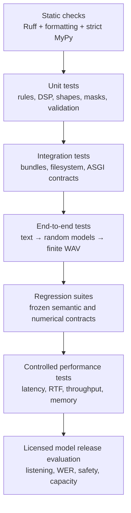

# Testing strategy and test maintenance

## 1. Test pyramid

The suite is divided by purpose rather than only execution time:

- `tests/unit`: deterministic functions, schemas, DSP, model/loss shapes, alignment, manifests.
- `tests/integration`: model bundle filesystem/load contract and ASGI endpoint behavior.
- `tests/e2e`: text through random acoustic/vocoder to finite RIFF WAV.
- `tests/regression`: frozen normalization semantics.
- `tests/performance`: marker and harness location for environment-specific benchmarks.

Synthetic audio and random small models validate engineering contracts without claiming speech quality.



## 2. Running tests

```bash
pytest -q
pytest tests/unit/test_normalizer.py -vv
pytest -m regression
pytest -m performance
pytest --cov=tts_pipeline --cov-report=term-missing
```

CI runs Python 3.11 and 3.12 after installing libsndfile/espeak. Local minimal environments can use the
SciPy WAV fallback. GPU tests are not required by default and must be separately provisioned.

## 3. Text tests

Normalizer tests are table-driven for currency, percentage, date/time, decimals, acronym, Unicode, and
control rejection. Regression snapshots intentionally make changed spoken semantics visible. When a rule
changes, add boundary/ordering cases and explain expected product reading; do not simply update snapshots
to make CI green.

Vocabulary tests verify unknown mapping, encode/decode, serialization, and tamper detection. Add tests
when changing special IDs because padding and checkpoints depend on exact ordering.

## 4. Audio tests

DSP tests assert mel bin/time shape, deterministic repeated values, finiteness, crossfade length, and WAV
headers. Extend with known sine frequency localization, silent/short/stereo/integer inputs, resampling
duration/passband, trim boundaries, batched mel, and reference-feature tolerance when changing DSP.

Avoid exact float goldens across library/hardware without justified tolerances. Keep a pinned CPU fixture
for semantic regressions and document any allowed drift.

## 5. Model and loss tests

Acoustic tests use variable token lengths, teacher durations summing to a common frame count, and both
training/predicted paths. They assert output shape and finite aggregate loss. Add mask assertions that
changing padded target values cannot change loss. Test duration bounding/position safety for corrupted
predictions.

Vocoder test asserts sample length equals frames times hop and `tanh` range. Discriminator/loss tests
should be expanded for a real training release to cover every scale/period, finite backward gradients,
and optimizer isolation.

## 6. Dataset and alignment tests

Manifest tests generate WAVs, validate count, and confirm deterministic splits by identities. Add corrupt,
missing, duplicate, rate warning, duration bound, and multi-speaker edge cases as loader behavior evolves.

Alignment tests verify exact sum and serialization and reject invalid sums. A production aligner adapter
needs frozen raw-output conversion fixtures, rounding residual cases, phone/token mapping, confidence/
quarantine, and frame-centering tests.

## 7. API tests

Integration tests inject a fake synthesizer so HTTP behavior does not depend on neural latency. ASGI
lifespan and `httpx.ASGITransport` exercise liveness/readiness, normalization, WAV response, and schema
rejection. Expand coverage for auth enabled/disabled, 413, 429, idempotency replay/conflict, queue timeout,
model-unready, response formats, metrics, streaming disconnect, request IDs, and exception sanitization.

Concurrency tests must avoid timing flakes: coordinate with events/barriers and assert admitted/rejected
states rather than sleeping arbitrary durations.

## 8. End-to-end semantics

The e2e test builds small random modules and grapheme backend, then ensures text becomes a finite WAV with
metadata. It catches integration shape/device/encoding failures. It does not assert intelligibility because
weights are random.

Quality e2e belongs in a controlled model evaluation environment with licensed bundle and gated audio
goldens. Keep large/private weights out of ordinary CI.

## 9. Performance and regression policy

Wall-clock thresholds on shared CI are unstable. Performance jobs should pin hardware/container/thread
counts, warm-up, input/token/output sizes, concurrency, and precision. Compare distributions and fail on
material regressions with noise budgets. Track memory and RTF alongside latency.

Regression fixtures should be small, versioned, reviewable, and tied to a documented contract. Update
only with intentional behavior/migration and release notes.

## 10. Static and supply-chain checks

Ruff enforces imports, correctness/security rules, and formatting. MyPy uses strict source-package
checking. `scripts/validate_docs.py` enforces H1 and heading hierarchy, balanced fences, Mermaid diagram
declarations, sequential numbered sections, and valid local links. CI also audits Python dependencies,
scans filesystem/container, and builds image. Production should add locked hashes, SBOM, signatures, and
secret scanning.

## 11. Writing a useful bug test

Reproduce the smallest failing boundary; assert externally meaningful behavior and error context; avoid
network/download/private data; prove the old behavior would fail; then add adjacent edge cases. For neural
bugs, control seeds/device/eval mode and assert shape/finiteness/mask or bounded tolerance rather than
fragile exact waveform unless exactness is the contract.
