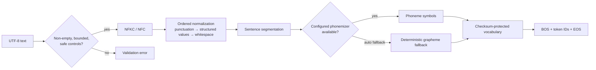

# Text normalization, phonemization, and tokenization

## 1. Why text processing is part of the model

A speech model does not understand arbitrary Unicode strings. It learns a mapping from a finite symbol
sequence to acoustics. Text processing defines what the system will say: whether `$12.50` becomes
“twelve dollars and fifty cents,” how `09:00` is read, whether an acronym is spelled, and what happens to
an unsupported character. A text-processing change can alter product meaning even when weights remain
unchanged, so rules require regression tests and version review.

The implemented stages are deterministic and ordered. `NormalizationResult` retains original text,
final text, and optionally every stage for debugging. Operational logs do not automatically store this
trace because it can contain private input.



## 2. Validation before normalization

Input must be a non-empty Python string after whitespace stripping and must not exceed configured
characters. C0 control characters are rejected except newline, tab, and carriage return, which are later
canonicalized as whitespace. This prevents invisible terminal/control behavior while permitting normal
multiline text.

HTTP validation adds language-code syntax, strict unknown-field rejection, and payload limits. The
normalizer remains independently safe for CLI/library callers.

## 3. Unicode normalization

The default is NFKC (Normalization Form Compatibility Composition). Canonical composition makes
equivalent combining sequences stable; compatibility folding additionally maps forms such as full-width
digits and many ligatures to ordinary characters. This reduces vocabulary fragmentation:

```text
Input:  "１  file"
NFKC:   "1  file"
```

The tradeoff is that compatibility distinctions can carry meaning in mathematical, historical, or
language-specific text. NFC preserves more distinctions. A deployment supporting such domains should
select NFC and build/evaluate a compatible vocabulary. The original string remains available for audit
and UI display.

## 4. Ordered transformation stages

Order matters because later regular expressions operate on earlier output:

1. **Unicode:** NFC/NFKC normalization.
2. **Punctuation:** curly quotes become straight quotes; en/em dashes become hyphens; ellipsis becomes
   three dots.
3. **URLs:** HTTP(S) URLs become a spoken website/domain form. Path details are discarded by the compact
   reference rule.
4. **Email:** local part and domain punctuation become “dot” and `@` becomes “at.”
5. **Abbreviations:** a fixed, word-bounded table expands common English abbreviations.
6. **Currency:** dollar, pound, and euro symbols expand major/minor units.
7. **Percent:** numeric value is normalized before “percent.”
8. **ISO date:** valid `YYYY-MM-DD` becomes month, ordinal day, and spoken year.
9. **24-hour time:** becomes 12-hour spoken time plus spelled `a m` or `p m`.
10. **Ordinals:** numeric English ordinal suffixes become words.
11. **Decimals:** digits after the decimal point are spoken individually.
12. **Integers:** commas and sign are handled, then bounded integers become English words.
13. **Acronyms:** consecutive uppercase ASCII letters are separated.
14. **Whitespace:** all whitespace runs collapse to one space and ends are stripped.

Example:

```text
Input:      Dr. Li paid €1.05 at 09:00 (25%).
Normalized: doctor Li paid one euro and five cents at nine o'clock a m
            (twenty five percent).
```

Run `POST /v1/normalize` with `trace=true` to inspect each intermediate value during development.

## 5. Number semantics and limits

The built-in English number renderer handles negative integers and scales through billions. Decimals
speak fractional digits individually, so `3.14` becomes “three point one four,” avoiding ambiguity about
fractional place values. Currency supports at most two captured decimal digits and pluralizes simple
major/minor units.

Dates accept only valid ISO dates; invalid dates remain unchanged and may then be processed as separate
numbers/hyphens. Time accepts `00:00` through `23:59`. These choices are deterministic but not locale-
universal. For example, `1,234`, `01/02/2026`, `$1 billion`, scientific notation, phone numbers, and
version strings may require domain-specific interpretation.

Production normalization should parse structured values where possible rather than growing one global
regex list. Each language/domain module needs table-driven tests for ambiguity and boundary cases.

## 6. URLs, email, and privacy

Speaking an entire tracking URL or private email may be undesirable. The reference URL rule keeps the
domain and discards paths; email retains the address in spoken form. Applications should decide whether
to reject, redact, spell, or transform these inputs based on privacy and user expectation. Normalized
text exposure is disabled in production configuration by default.

## 7. Sentence segmentation and long text

Segmentation splits after `.`, `!`, or `?` followed by whitespace, and at newlines. It retains terminal
punctuation. This is deterministic but is not a full linguistic sentence tokenizer: abbreviations,
decimal punctuation, quotes, and languages without the same punctuation conventions can require a
language-aware segmenter.

After phonemization, any sentence longer than `max_tokens_per_chunk` is divided into bounded token
windows with BOS/EOS repaired. This is a safety fallback, not ideal prosodic phrasing. Applications should
prefer semantically meaningful input paragraphs and language-aware segmentation.

## 8. Phonemization

Phonemes expose pronunciation more directly than spelling. They help with irregular English words and
reduce the acoustic model’s need to infer grapheme-to-sound rules. They still omit sentence prosody,
coarticulation, emotion, and many allophonic details. A phoneme string is meaningful only with its
backend, version, language, and separator conventions.

`Phonemizer` supports:

- `grapheme`: always use printable lowercase characters and `|` for whitespace;
- `espeak`: require the optional Python package and local espeak backend, failing if unavailable; and
- `auto`: use espeak when importable, otherwise fall back to graphemes. Runtime backend failures in auto
  mode also fall back.

Results are cached in a bounded per-instance dictionary keyed by text/language. The cache avoids repeated
work without retaining an unbounded lifetime-global reference to the instance.

Automatic fallback provides availability, but it can change token semantics if one replica has espeak
and another does not. Production should select a backend explicitly, verify it at readiness, pin its
version, and export a vocabulary built from the same symbol stream.

## 9. Vocabulary contract

The first symbols are always:

| ID | Symbol | Purpose |
|---:|---|---|
| 0 | `<pad>` | batch padding and embedding padding index |
| 1 | `<unk>` | unsupported symbol |
| 2 | `<bos>` | beginning of sequence |
| 3 | `<eos>` | end of sequence |
| 4 | `|` | optional word boundary |

Observed non-special symbols are sorted to make vocabulary construction deterministic. Encoding maps
unknown symbols to ID 1 and normally adds boundaries. Decoding validates every ID and can omit angle-
bracket special symbols. JSON stores format version, ordered symbols, and SHA-256; loading recomputes the
hash and can compare the checksum expected by a model bundle.

Vocabulary order is part of the weights: changing an ID while keeping the same symbol set causes the
embedding to speak the wrong symbols. Never regenerate a vocabulary for an existing acoustic checkpoint.

## 10. Language expansion procedure

Supporting a language is more than accepting its BCP-47 code:

1. define Unicode and punctuation policy;
2. implement numbers, dates, times, currency, abbreviations, and symbols for the locale;
3. choose and pin a phonemizer plus phoneme inventory;
4. define mixed-script and unknown-character behavior;
5. build a compatible vocabulary and language ID mapping;
6. collect licensed, consented data with accurate language labels;
7. test pronunciation, code-switching, segmentation, and normalization tables; and
8. evaluate native-speaker intelligibility/naturalness and document limitations.

Adding a language to bundle metadata without these steps only bypasses validation; it does not produce a
multilingual model.

## 11. Debugging checklist

When speech is wrong, inspect in this order: original text, every normalization stage, sentence chunks,
phonemizer backend/version, symbol sequence, token IDs/vocabulary checksum, durations, then acoustics.
This prevents misdiagnosing “the model pronounced `$` badly” when the actual problem is that `$` reached
the vocabulary as `<unk>`.
