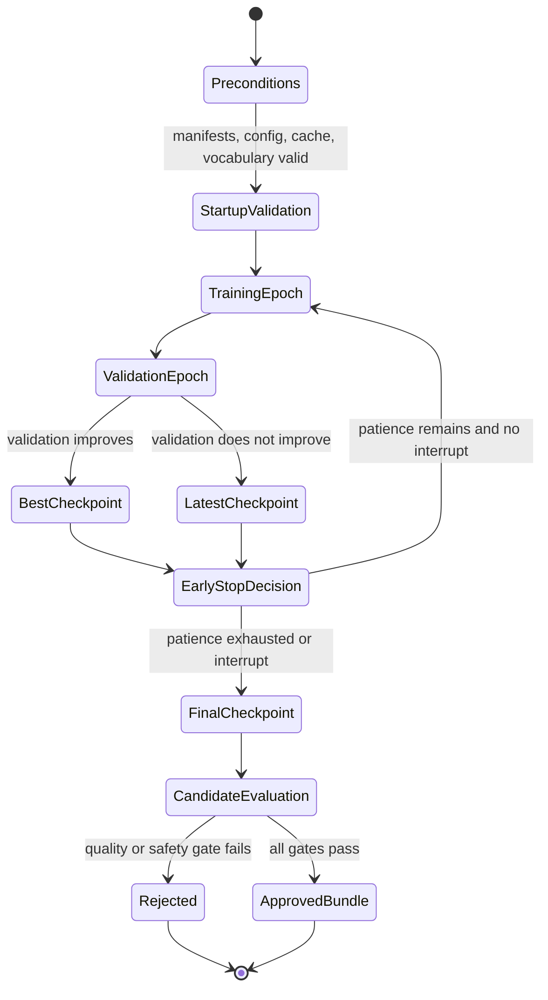

# Training orchestration and reproducibility

## 1. Preconditions

Training is the last step, not the first debugging tool. Before allocating a GPU, require a valid resolved
configuration, frozen train/validation manifests, consent/provenance review, compatible vocabulary,
finite cached features, exact duration sums, adequate speaker distribution, and a successful tiny
overfit experiment.

The CLI startup report records resolved config, Git revision, Python/PyTorch, CUDA/device, parameter
count, dataset sizes, speaker count, vocabulary size, feature parameters, and seed. Retain it with run
artifacts.



## 2. Reproducibility model

`seed_everything` seeds Python, NumPy, PyTorch, and CUDA and requests deterministic algorithms. This does
not guarantee bit-identical training across PyTorch/CUDA drivers, GPU architectures, distributed order,
thread scheduling, or unseeded DataLoader workers. Reproducibility is a chain:

```text
source bytes + manifest/split + preprocessing assets/config + code/container
+ dependency versions + RNG/worker/rank state + hardware behavior
```

Record every link. Compare metrics within meaningful tolerances and investigate unexplained drift.

## 3. Acoustic DataLoader and collation

`PreprocessedDataset` reads one compressed feature file per index row. `collate_acoustic` pads token
fields to batch maximum `T` and mel to maximum `F`, creating token lengths. Model masks derive from these
lengths. Padding is zero, but loss correctness depends on masks, not the numerical padding value.

The CLI creates a seeded 90/10 random split of the preprocessed dataset when more than one record exists.
For production, use previously frozen manifest splits rather than deriving validation after preprocessing.
Implement length bucketing and distributed samplers for efficiency and scale.

## 4. Optimizer and scheduler

Acoustic training uses AdamW at configured learning rate/weight decay and an exponential scheduler with
factor 0.999 per epoch. AdamW keeps decoupled weight decay. The reference applies one optimizer group to
all parameters; larger experiments may exclude bias/normalization/embedding parameters from decay or use
warm-up schedules.

Any optimizer/schedule change can alter convergence and must be recorded. Learning rate should be
interpreted with effective batch size and precision, not copied blindly from a paper.

## 5. Gradient accumulation

Loss is divided by `gradient_accumulation` before backward. After the configured number of batches, the
trainer unscales gradients, clips global norm, steps optimizer/scaler, zeros gradients, and increments
global step. Thus effective batch grows without storing all examples simultaneously.

If epoch ends with an incomplete accumulation window, the compact loop does not perform a final partial
step. Choose data/batch sizes accordingly or extend the trainer with a tested remainder step.

## 6. Mixed precision and clipping

AMP is enabled only for CUDA when configured. Autocast selects lower precision for safe operations;
GradScaler magnifies loss to avoid underflow, then unscales before gradient clipping. Non-finite total
loss raises immediately. Gradient norm clipping limits a single unstable batch but repeated clipping is a
signal to inspect targets, learning rate, and loss scales.

CPU mode is intended for correctness development. GPU mode requires a compatible PyTorch build and
memory-aware batch/concurrency configuration.

## 7. Epoch and validation loop

Training mode enables dropout/BatchNorm updates and gradients. Validation uses eval behavior and no
gradient updates. Mean total loss is calculated over batches. Scheduler advances after validation.

When validation improves, `best.pt` is written and stale count resets. Otherwise stale count increments.
Training stops after configured patience or a graceful interrupt. `latest.pt` is written every epoch and
in `finally`, plus periodic step checkpoints.

Validation loss with teacher variance targets is not enough: periodically synthesize fixed texts using
predicted durations/pitch/energy and a validated vocoder, then inspect intelligibility and duration.

## 8. Checkpoint recovery

Resume verifies sidecar hash, safely loads checkpoint, restores model, optimizer, scheduler, scaler, and
`TrainState`. It does not restore DataLoader iterator position inside an epoch, so resume begins from the
stored epoch boundary in ordinary use. Exact mid-epoch distributed resume would require sampler/RNG/
iterator state.

Checkpoint files are trusted build artifacts despite `weights_only=True`. Do not resume files supplied by
an untrusted user.

## 9. Early stopping and divergence

Early stopping protects against wasted training and overfitting only if validation is representative and
loss correlates with quality. Keep patience large enough for noisy validation. Store the best candidate
and compare listening/intelligibility metrics before release.

Divergence signals include NaN/inf, rapidly growing mel/duration loss, near-zero or saturated durations,
all-silence generated mel, excessive clipping, and discriminator collapse. Stop, retain offending sample
IDs and numeric summaries, and diagnose rather than automatically retrying with altered state.

## 10. Experiment tracking

`LocalTracker` appends JSONL events for parameters, metrics, and artifacts under run directory. It is the
offline default. `MLflowTracker` is optional and only imports MLflow when selected. A tracking backend
must never receive transcripts, raw speaker identity, secrets, or unauthorized audio.

Record run name, source/data fingerprints, config, code/container, parents/resume source, metrics, sample
audio access controls, and final disposition (failed/candidate/rejected/approved).

## 11. Distributed training path

The model structure is DDP-compatible but the CLI does not launch DDP. A production extension should:

- initialize process group and one device per rank;
- wrap model in DistributedDataParallel;
- use a distributed, epoch-seeded sampler;
- reduce validation metrics across ranks;
- allow only rank zero to track/write checkpoints;
- make accumulation and no-sync behavior explicit; and
- capture world size and rank-aware seeds.

Do not use DataParallel as a drop-in quality/performance assumption. Test checkpoint portability between
wrapped/unwrapped state dictionaries.

## 12. Recommended development progression

1. Run unit/e2e tests.
2. Create synthetic fixture and execute preprocessing.
3. Overfit one real authorized utterance; confirm loss falls and duration sum is correct.
4. Overfit a tiny multi-utterance subset; listen through a ground-truth-capable vocoder.
5. Train on a clean small corpus and validate predicted-mode synthesis.
6. Scale data/model only after pipeline quality is understood.
7. Freeze a candidate, run the evaluation matrix, complete cards/reviews, and export an immutable bundle.

## 13. Command examples

```bash
tts train-acoustic processed/index.jsonl vocabulary.json --run-dir runs/acoustic \
  --config configs/development.yaml

tts train-acoustic processed/index.jsonl vocabulary.json --run-dir runs/acoustic \
  --resume runs/acoustic/latest.pt --config configs/development.yaml

tts train-vocoder manifest.jsonl --run-dir runs/vocoder \
  --config configs/development.yaml
```

Development configuration is intentionally small and not a quality recipe.
