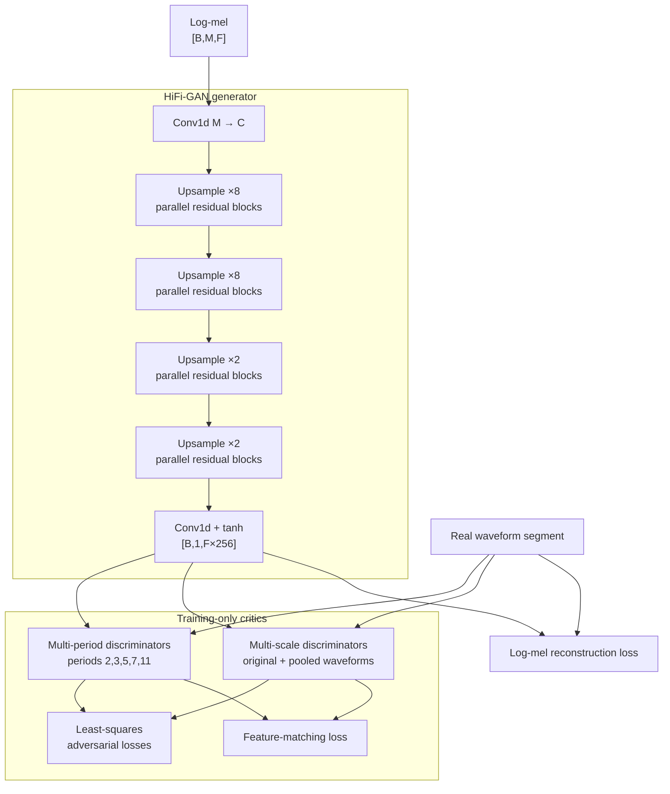

# HiFi-GAN-style neural vocoder

## 1. Role and compatibility boundary

The vocoder maps log-mel `[B,M,F]` to waveform `[B,1,F*HOP]`. It learns phase and fine temporal detail
that a magnitude mel spectrogram does not contain. It is compatible only with the exact feature
definition used during training—not merely the same number of mel bins.

The implementation includes a complete generator, multi-period discriminator (MPD), multi-scale
discriminator (MSD), adversarial/feature/mel losses, independent optimizers and schedulers, and resumable
state. It is a compact HiFi-GAN-style reference; quality requires real training and tuned segment/batch
sizes.

## 2. Generator tensor flow

The generator begins with weight-normalized Conv1d `M -> C`, kernel 7. For every configured stage:

1. apply leaky ReLU;
2. transposed-convolve with stride equal to upsample rate;
3. halve channels;
4. run parallel residual blocks with different kernels; and
5. average residual-block outputs.

With rates `[8,8,2,2]`, time expands by `8*8*2*2=256`. Therefore three input frames generate 768
samples. The transposed-convolution padding `(kernel-rate)/2` assumes compatible even differences and is
chosen for exact scaling.

After all stages, leaky ReLU and kernel-seven Conv1d map channels to one waveform, then `tanh` bounds
samples. Weight normalization separates parameter magnitude/direction during training. PyTorch warns the
legacy helper is deprecated; migrating to parametrizations requires checkpoint compatibility testing.

## 3. Residual blocks and receptive field

Each `ResBlock` has same-channel convolutions at dilations `(1,3,5)`. A dilated convolution spaces kernel
taps apart, expanding temporal context without equal parameter growth. Every convolution predicts a
residual added to the running state. Parallel kernel sizes `(3,7,11)` capture different periodic and
transient scales.

The generator remains non-causal: output around a point depends on neighboring mel frames. True
incremental streaming requires overlap/context management or a causal architecture.

## 4. Multi-period discriminator

Speech contains periodic voiced structure. A period discriminator pads waveform length to a multiple of
prime period `p`, reshapes `[B,1,S]` to `[B,1,S/p,p]`, and applies 2D convolutions. The MPD uses periods
2, 3, 5, 7, and 11. Different primes expose periodic artifacts that a single waveform discriminator may
miss.

Each layer returns feature maps as well as a final score. Reflection padding is used for the short tail;
training segments must be long enough for valid reflection behavior.

## 5. Multi-scale discriminator

Scale discriminators apply grouped 1D convolutions directly to waveform. Three copies inspect original,
once-pooled, and twice-pooled audio. Fine scale captures local waveform detail; coarser scale captures
longer structure at lower computational resolution. Grouped convolutions control cost while increasing
channels.

MPD and MSD outputs are concatenated conceptually for losses. Neither is used at inference; only the
generator enters the model bundle.

## 6. Adversarial objectives

Least-squares discriminator loss for real score `D(x)` and generated score `D(G(m))` is:

`L_D = mean((1-D(x))²) + mean(D(G(m))²)`.

Generator adversarial loss is:

`L_adv = mean((1-D(G(m)))²)`.

Least-squares loss provides smoother gradients than original binary cross-entropy GAN loss. Scores are
aggregated across every MPD/MSD sub-discriminator.

## 7. Feature matching and mel reconstruction

Feature matching compares discriminator intermediate activations:

`L_FM = Σ_i mean(abs(f_i(x) - f_i(G(m))))`.

Real activations are detached so generator optimization does not change discriminators through this
term. Matching multiple learned representations stabilizes training and encourages perceptual structure.

Mel reconstruction extracts configured mel features from real and generated waveform and applies L1 over
common frames. Generator objective is:

`L_G = L_adv + 2 L_FM + 45 L_mel`.

These reference weights are explicit in `VocoderTrainer`; changes should be configuration-driven in a
larger experiment and recorded with evaluation.

## 8. Alternating optimization schedule

For each batch:

1. generate fake waveform from mel;
2. crop real/fake to common sample length;
3. evaluate real and detached fake through MPD+MSD;
4. zero discriminator gradients, backpropagate discriminator loss, and step discriminator optimizer;
5. reevaluate fake without detach and real features;
6. calculate adversarial, feature-matching, and mel losses;
7. zero generator gradients, backpropagate, and step generator optimizer; and
8. update AMP scaler and global step.

Both optimizers use AdamW with betas `(0.8,0.99)` and separate exponential schedulers. In production,
monitor discriminator/generator balance; a discriminator that becomes perfect too quickly can starve the
generator, while a weak discriminator allows noisy artifacts.

## 9. Training segments

`VocoderDataset` loads/preprocesses waveform and selects a deterministic fixed segment using record
identity. Short audio is right-padded. Mel is computed from exactly that segment. Fixed lengths simplify
batching and discriminator shapes.

The reference default of 32 frames is small for smoke tests. Natural vocoder training normally uses
longer segments sufficient for pitch periods and receptive fields, many clean hours, randomized crops
across epochs, and validation synthesis. Deterministic crops reduce coverage; a seeded epoch-aware crop
policy is a recommended production improvement.

## 10. Checkpoint and resume

Vocoder checkpoint stores generator, MPD, MSD, both optimizer states, both scheduler states, AMP scaler,
epoch, and global step, plus SHA-256 sidecar. Resume verifies integrity and restores every component.
Loading only generator weights and fresh discriminators is not equivalent to resuming adversarial
training.

Export currently constructs a generator and can load an acoustic checkpoint; integrating trained
vocoder checkpoints into a release workflow should extract the generator state after compatibility and
quality approval.

## 11. Inference

Inference calls generator in eval and `torch.inference_mode`, transposing acoustic output `[B,F,M]` to
`[B,M,F]`. Discriminators and mel loss are absent. Output is moved to CPU, chunks are crossfaded, and the
combined waveform is normalized/encoded.

Warm-up is important because first convolution calls and GPU kernels include initialization overhead.
Mixed precision may speed inference but should be evaluated for noise and instability before enabling.

## 12. Common artifacts and diagnosis

- **Buzzing/metallic tone:** feature mismatch, undertraining, transposed-convolution artifacts, or
  discriminator imbalance.
- **Muffled output:** f-max/mel-scale mismatch or acoustic mel over-smoothing.
- **Clicks at boundaries:** inadequate chunk overlap/context or inconsistent waveform levels.
- **Incorrect duration but clear sound:** acoustic duration issue, not vocoder.
- **Noise on random bundle:** expected; a randomly initialized generator is only an interface smoke test.
- **Length mismatch:** upsample product/padding or mel-frame convention mismatch.

Compare reconstruction from ground-truth mel before blaming acoustic predictions. If ground-truth mel
sounds poor, fix vocoder/features first.
